# VoltHub / VoltReport — Dokumen Arsitektur Sistem

**Sistem Manajemen Operasi & Pelaporan Lapangan Telekomunikasi SCADA**
Dokumen pendukung proposal pengajuan aplikasi.

| | |
|---|---|
| **Nama Sistem** | VoltHub (kode repo: VoltReport) |
| **Domain** | Operasi & pemeliharaan aset telekomunikasi SCADA PLN — Gardu Induk (GI), Gardu Hubung (GH), Gardu Distribusi / Metering Point (MP) |
| **Unit Pengguna** | RTUPP 1–5 di bawah UP3, beserta NOC (control room) dan manajemen UP3 |
| **Arsitektur** | 3-tier, API-first, multi-tenant per RTUPP, offline-first mobile |
| **Versi Dokumen** | 1.0 — 27 Juli 2026 |

---

## Daftar Isi

1. [Ringkasan Eksekutif](#1-ringkasan-eksekutif)
2. [Arsitektur Sistem](#2-arsitektur-sistem)
3. [Technology Stack](#3-technology-stack)
4. [Model Peran & Hak Akses (RBAC)](#4-model-peran--hak-akses-rbac)
5. [Isolasi Data Multi-Tenant](#5-isolasi-data-multi-tenant)
6. [Model Data](#6-model-data)
7. [Use Case](#7-use-case)
8. [Alur Bisnis End-to-End](#8-alur-bisnis-end-to-end)
9. [Sequence Diagram](#9-sequence-diagram)
10. [Arsitektur Keamanan](#10-arsitektur-keamanan)
11. [Kebutuhan Non-Fungsional](#11-kebutuhan-non-fungsional)
12. [Deployment & Lingkungan](#12-deployment--lingkungan)
13. [Skala Sistem Saat Ini](#13-skala-sistem-saat-ini)

---

## 1. Ringkasan Eksekutif

### 1.1 Permasalahan

Pengelolaan aset telekomunikasi SCADA (RTU, FDI, rectifier, battery bank, router/modem/radio) yang tersebar di ribuan gardu selama ini bergantung pada:

- **Spreadsheet manual** — laporan inspeksi & pemeliharaan diisi di Excel, dikirim via WhatsApp, direkap ulang oleh admin.
- **Tidak ada jejak audit** — tidak dapat ditelusuri siapa mengubah apa dan kapan.
- **Data aset terfragmentasi** — registry gardu/penyulang/aset terpisah dari data operasional SCADA (export Master Station IFS).
- **Tidak ada penugasan terstruktur** — pekerjaan lapangan tidak terikat pada perintah kerja formal yang dapat dipantau.
- **Sinyal lemah di lapangan** — petugas sering berada di lokasi tanpa koneksi data.

### 1.2 Solusi

VoltHub adalah platform terpadu yang menyatukan **registry aset**, **manajemen perintah kerja (Work Order)**, **pelaporan lapangan digital**, **approval berjenjang**, dan **monitoring SCADA/GIS** dalam satu sumber data tunggal, dengan:

- Aplikasi **web** (desktop command center) + aplikasi **mobile native** (Android/iOS via Capacitor) dari satu basis kode.
- Kemampuan **offline-first**: petugas dapat mengisi laporan tanpa sinyal, data tersinkronisasi otomatis saat koneksi kembali — dengan jaminan anti-duplikat.
- **Isolasi data per RTUPP** yang ditegakkan di lapisan server (fail-closed), bukan hanya di UI.
- **Tanda tangan digital Ed25519** pada setiap dokumen laporan yang dihasilkan, dapat diverifikasi publik lewat QR code secara offline.
- **AI Assistant** berbasis natural language yang tunduk pada RBAC dan tenant scope yang sama dengan aplikasi.

### 1.3 Nilai yang Diberikan

| Aspek | Sebelum | Sesudah |
|---|---|---|
| Waktu rekap laporan | Manual, harian–mingguan | Otomatis, real-time |
| Ketertelusuran | Tidak ada | Audit trail penuh (siapa, kapan, IP, user-agent) |
| Validasi laporan | Via chat, tidak terstruktur | Workflow approval bertahap dengan status terkontrol |
| Integritas dokumen | Tidak terjamin | Ed25519 + SHA-256, verifikasi QR publik |
| Kerja tanpa sinyal | Tidak mungkin | Offline queue + auto-sync + idempotency |
| Visibilitas manajemen | Laporan berkala | Dashboard KPI & GIS real-time |

---

## 2. Arsitektur Sistem

### 2.1 Diagram Konteks (C4 Level 1)

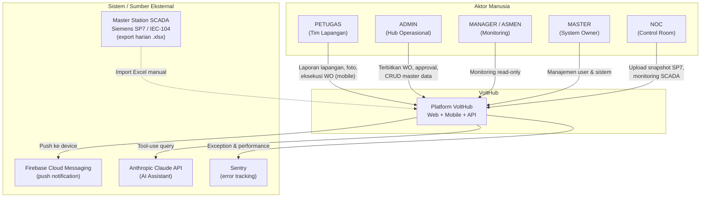
```mermaid
graph TB
    subgraph Aktor["Aktor Manusia"]
        P["PETUGAS<br/>(Tim Lapangan)"]
        A["ADMIN<br/>(Hub Operasional)"]
        M["MANAGER / ASMEN<br/>(Monitoring)"]
        MS["MASTER<br/>(System Owner)"]
        N["NOC<br/>(Control Room)"]
    end

    subgraph Sistem["VoltHub"]
        VH["Platform VoltHub<br/>Web + Mobile + API"]
    end

    subgraph Eksternal["Sistem / Sumber Eksternal"]
        IFS["Master Station SCADA<br/>Siemens SP7 / IEC-104<br/>(export harian .xlsx)"]
        FCM["Firebase Cloud Messaging<br/>(push notification)"]
        LLM["Anthropic Claude API<br/>(AI Assistant)"]
        SEN["Sentry<br/>(error tracking)"]
    end

    P -->|"Laporan lapangan, foto,<br/>eksekusi WO (mobile)"| VH
    A -->|"Terbitkan WO, approval,<br/>CRUD master data"| VH
    M -->|"Monitoring read-only"| VH
    MS -->|"Manajemen user & sistem"| VH
    N -->|"Upload snapshot SP7,<br/>monitoring SCADA"| VH

    IFS -.->|"Import Excel manual"| VH
    VH -->|"Push ke device"| FCM
    VH -->|"Tool-use query"| LLM
    VH -->|"Exception & performance"| SEN
```

### 2.2 Diagram Container (C4 Level 2)

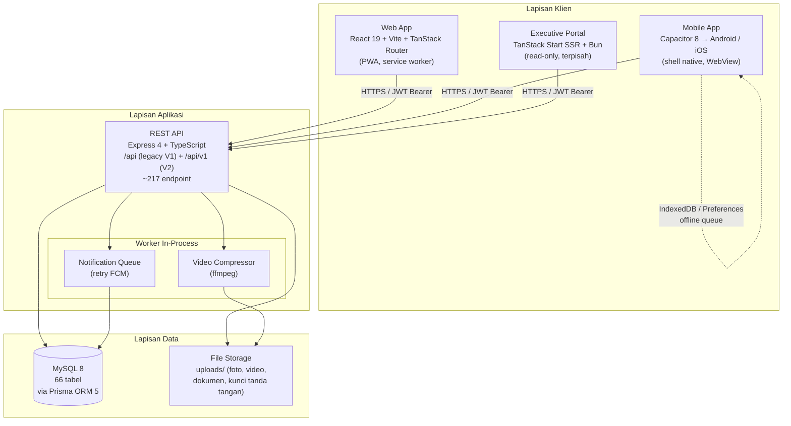
```mermaid
graph TB
    subgraph Client["Lapisan Klien"]
        WEB["Web App<br/>React 19 + Vite + TanStack Router<br/>(PWA, service worker)"]
        MOB["Mobile App<br/>Capacitor 8 → Android / iOS<br/>(shell native, WebView)"]
        POR["Executive Portal<br/>TanStack Start SSR + Bun<br/>(read-only, terpisah)"]
    end

    subgraph Server["Lapisan Aplikasi"]
        API["REST API<br/>Express 4 + TypeScript<br/>/api (legacy V1) + /api/v1 (V2)<br/>~217 endpoint"]
        subgraph Workers["Worker In-Process"]
            NQ["Notification Queue<br/>(retry FCM)"]
            VQ["Video Compressor<br/>(ffmpeg)"]
        end
    end

    subgraph Data["Lapisan Data"]
        DB[("MySQL 8<br/>66 tabel<br/>via Prisma ORM 5")]
        FS["File Storage<br/>uploads/ (foto, video,<br/>dokumen, kunci tanda tangan)"]
    end

    WEB -->|"HTTPS / JWT Bearer"| API
    MOB -->|"HTTPS / JWT Bearer"| API
    POR -->|"HTTPS / JWT Bearer"| API
    API --> DB
    API --> FS
    API --> NQ
    API --> VQ
    NQ --> DB
    VQ --> FS
    MOB -.->|"IndexedDB / Preferences<br/>offline queue"| MOB
```

**Prinsip pemisahan:**

- **Satu backend, tiga klien.** Tidak ada logika bisnis yang diduplikasi di klien. Portal eksekutif mengonsumsi API yang sama.
- **Web dan mobile satu basis kode.** Capacitor membungkus build web yang sama; kapabilitas native (kamera, GPS, push, network) diakses lewat lapisan adapter `lib/native/`.
- **Worker in-process** (bukan Redis/BullMQ) — dipilih agar deployment tetap single-node sederhana; antrean dipersistensi di tabel MySQL sehingga tetap tahan restart.

### 2.3 Struktur Modul Backend (C4 Level 3)

Backend terbagi menjadi dua generasi yang hidup berdampingan:

- **V1 (`src/routes/` + `src/controllers/`)** — endpoint legacy pelaporan awal/akhir, rekap, ekspor. Mount di `/api/*`.
- **V2 (`src/modules/`)** — arsitektur modular per domain, setiap modul berisi `*.routes.ts` → `*.controller.ts` → `*.service.ts` → `*.repository.ts`. Mount di `/api/v1/*`.

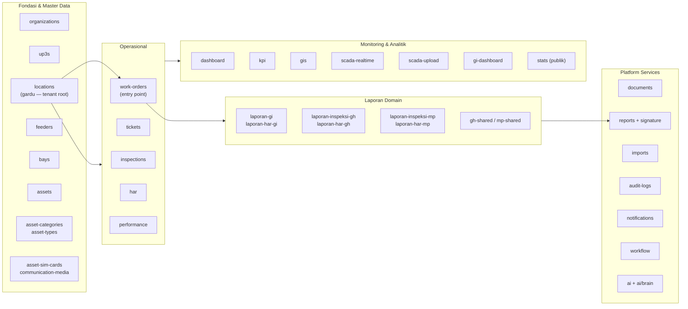
```mermaid
graph LR
    subgraph Foundation["Fondasi & Master Data"]
        ORG["organizations"]
        UP3["up3s"]
        LOC["locations<br/>(gardu — tenant root)"]
        FEE["feeders"]
        BAY["bays"]
        AST["assets"]
        ATC["asset-categories<br/>asset-types"]
        SIM["asset-sim-cards<br/>communication-media"]
    end

    subgraph Ops["Operasional"]
        WO["work-orders<br/>(entry point)"]
        TIK["tickets"]
        INS["inspections"]
        HAR["har"]
        PERF["performance"]
    end

    subgraph Laporan["Laporan Domain"]
        GI["laporan-gi<br/>laporan-har-gi"]
        GH["laporan-inspeksi-gh<br/>laporan-har-gh"]
        MP["laporan-inspeksi-mp<br/>laporan-har-mp"]
        SH["gh-shared / mp-shared"]
    end

    subgraph Monitoring["Monitoring & Analitik"]
        DSH["dashboard"]
        KPI["kpi"]
        GIS["gis"]
        SCR["scada-realtime"]
        SCU["scada-upload"]
        GID["gi-dashboard"]
        STA["stats (publik)"]
    end

    subgraph Platform["Platform Services"]
        DOC["documents"]
        REP["reports + signature"]
        IMP["imports"]
        AUD["audit-logs"]
        NOT["notifications"]
        WFL["workflow"]
        AI["ai + ai/brain"]
    end

    LOC --> WO
    WO --> Laporan
    LOC --> Ops
    Ops --> Monitoring
    Laporan --> REP
```

---

## 3. Technology Stack

### 3.1 Backend

| Kategori | Teknologi | Versi | Peran |
|---|---|---|---|
| Runtime | Node.js | ≥ 18 | Server runtime |
| Bahasa | TypeScript | 5.3 | Type safety end-to-end |
| Framework | Express.js | 4.18 | HTTP layer |
| ORM | Prisma | 5.10 | Query builder + migrasi + type generation |
| Database | MySQL | 8.x | Penyimpanan relasional utama |
| Autentikasi | jsonwebtoken + bcryptjs | 9.0 / 2.4 | JWT HS256 + hashing password |
| Validasi | Zod + express-validator | 3.22 / 7.0 | Validasi skema request |
| Keamanan HTTP | helmet, cors, express-rate-limit | 7.1 / 2.8 / 7.5 | Header hardening, CORS allowlist, throttling |
| Upload | multer | 1.4 | Multipart handling |
| Dokumen | pdfkit, exceljs, qrcode, archiver | — | Generate PDF/Excel, QR tanda tangan, ZIP |
| Kriptografi | Node `crypto` (Ed25519, SHA-256) | built-in | Tanda tangan digital dokumen |
| Media | ffmpeg-static + fluent-ffmpeg | 5.3 / 2.1 | Kompresi video lampiran laporan GI |
| Observability | Sentry Node, morgan | 8.55 | Error tracking + access log |
| AI | @anthropic-ai/sdk | 0.104 | AI Assistant (Claude) |
| Dokumentasi API | swagger-ui-express + OpenAPI | 5.0 | `/api/docs` interaktif |
| Testing | Vitest + Supertest | 2.1 / 7.2 | Unit + integration test |

### 3.2 Frontend (Web + Mobile)

| Kategori | Teknologi | Versi | Peran |
|---|---|---|---|
| Framework | React | 19.2 | UI library |
| Build tool | Vite | 8.0 | Dev server + bundler |
| Routing | TanStack Router | 1.168 | File-based routing + type-safe navigation + route guard |
| Data fetching | TanStack Query | 5.83 | Server-state cache, retry policy, invalidation |
| Tabel | TanStack Table | 8.21 | Data grid rekap |
| State | Zustand | 5.0 | Auth store, nav store, notification store |
| Form | React Hook Form + Zod resolver | 7.71 | Form multi-section (laporan 152 kolom) |
| UI | Radix UI + Tailwind CSS 4 + CVA | — | Komponen aksesibel, design system |
| Peta | Leaflet + react-leaflet + markercluster + heat | 1.9 / 5.0 | GIS monitoring |
| Chart | Recharts | 2.15 | Dashboard KPI |
| Animasi | Motion, Lenis | 12.4 / 1.3 | Transisi & smooth scroll |
| Native shell | Capacitor | 8.4 | Android/iOS: camera, geolocation, push, network, preferences, status bar, splash, keyboard |
| PWA | vite-plugin-pwa (Workbox) | 1.3 | Service worker, offline shell, update prompt |
| API client | Axios + openapi-typescript | 1.16 / 7.13 | HTTP client + tipe hasil generate dari OpenAPI |
| Observability | Sentry React | 8.55 | Error boundary + reporting |
| Testing | Playwright | 1.60 | End-to-end test |

### 3.3 Executive Portal

| Kategori | Teknologi | Peran |
|---|---|---|
| Framework | TanStack Start (SSR) | Server-side rendering |
| Runtime | Bun | Runtime & package manager |
| UI | Tailwind v4 + Radix UI | Konsisten dengan aplikasi utama |

### 3.4 Justifikasi Pemilihan Teknologi

| Keputusan | Alasan |
|---|---|
| **Capacitor, bukan React Native** | Satu basis kode web + mobile; tim tidak perlu memelihara dua UI; akses native tetap penuh untuk kamera/GPS/push. |
| **MySQL, bukan PostgreSQL** | Menyesuaikan standar infrastruktur database eksisting di lingkungan pengguna. |
| **Prisma** | Migrasi versioned (47 migrasi terlacak), tipe otomatis dari skema, dan `where`-fragment yang memudahkan penegakan tenant scope secara konsisten. |
| **Worker in-process** | Menghindari dependensi Redis/broker terpisah; antrean dipersistensi di MySQL sehingga tetap durable. |
| **JWT stateless + refresh store** | Access token stateless (skalabel), refresh token disimpan server-side agar tetap dapat dicabut. |
| **Ed25519 asimetris** | Kunci publik dapat dipublikasikan sehingga PDF dapat diverifikasi offline tanpa memanggil server. |

---

## 4. Model Peran & Hak Akses (RBAC)

### 4.1 Lima Peran Kanonik

Sumber kebenaran tunggal: `BE/src/auth/roles.ts`. Frontend (`FE/src/lib/v2/rbac.ts`) hanya **mencerminkan** definisi ini untuk menyembunyikan kontrol yang akan ditolak server — penegakan sesungguhnya selalu di backend.

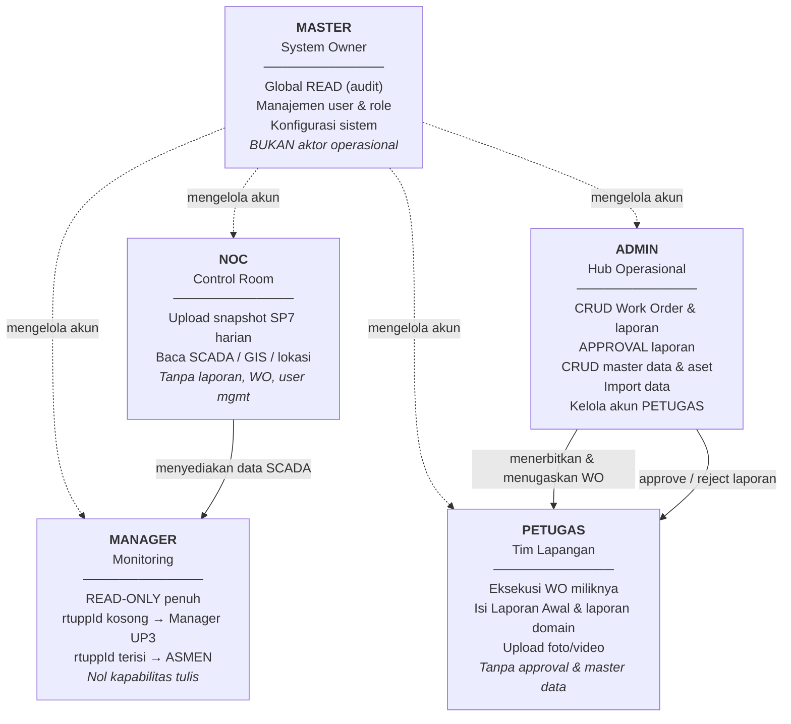
```mermaid
graph TB
    MS["<b>MASTER</b><br/>System Owner<br/>─────────────<br/>Global READ (audit)<br/>Manajemen user & role<br/>Konfigurasi sistem<br/><i>BUKAN aktor operasional</i>"]
    MG["<b>MANAGER</b><br/>Monitoring<br/>─────────────<br/>READ-ONLY penuh<br/>rtuppId kosong → Manager UP3<br/>rtuppId terisi → ASMEN<br/><i>Nol kapabilitas tulis</i>"]
    AD["<b>ADMIN</b><br/>Hub Operasional<br/>─────────────<br/>CRUD Work Order & laporan<br/>APPROVAL laporan<br/>CRUD master data & aset<br/>Import data<br/>Kelola akun PETUGAS"]
    PT["<b>PETUGAS</b><br/>Tim Lapangan<br/>─────────────<br/>Eksekusi WO miliknya<br/>Isi Laporan Awal & laporan domain<br/>Upload foto/video<br/><i>Tanpa approval & master data</i>"]
    NC["<b>NOC</b><br/>Control Room<br/>─────────────<br/>Upload snapshot SP7 harian<br/>Baca SCADA / GIS / lokasi<br/><i>Tanpa laporan, WO, user mgmt</i>"]

    MS -.->|"mengelola akun"| MG
    MS -.->|"mengelola akun"| AD
    MS -.->|"mengelola akun"| PT
    MS -.->|"mengelola akun"| NC
    AD -->|"menerbitkan & menugaskan WO"| PT
    AD -->|"approve / reject laporan"| PT
    NC -->|"menyediakan data SCADA"| MG
```

**Catatan desain penting:**

| Keputusan | Rasional |
|---|---|
| **MASTER dikeluarkan dari seluruh operasi tulis** | Pemisahan tugas (segregation of duties): pemilik sistem tidak boleh sekaligus menjadi aktor operasional yang menyetujui datanya sendiri. MASTER hanya memegang `users.manage` dan `system.access`. |
| **ASMEN bukan role baru** | ASMEN = MANAGER dengan `rtuppId` terisi. Menghindari ledakan jumlah role; pembedaan dilakukan lewat scope, bukan lewat enum baru. |
| **NOC tidak masuk grup mana pun** | Aksesnya didefinisikan secara eksplisit sebagai permukaan SCADA + GIS read-only, sehingga penambahan role tidak secara tidak sengaja memperluas hak. |
| **Fallback least privilege** | Role tidak dikenal → `null` di backend (ditolak) dan `PETUGAS` di frontend (hak paling rendah). |
| **Normalisasi role legacy** | `SUPERADMIN → MASTER`, `ADMIN_RTUPP → ADMIN`, `USER → PETUGAS`. Token dan baris lama tetap berfungsi tanpa migrasi data paksa. |

### 4.2 Matriks Kapabilitas

Kapabilitas semantik (`FE/src/lib/v2/rbac.ts` ↔ grup role backend). ✅ = diizinkan, — = ditolak.

| Kapabilitas | MASTER | MANAGER | ADMIN | PETUGAS | NOC |
|---|:---:|:---:|:---:|:---:|:---:|
| **Master Data** | | | | | |
| `locations.write` (gardu) | — | — | ✅ | — | — |
| `feeders.write` (penyulang) | — | — | ✅ | — | — |
| `bays.write` | — | — | ✅ | — | — |
| `assets.write` | — | — | ✅ | — | — |
| `simCards.write` | — | — | ✅ | — | — |
| `commMedia.write` | — | — | ✅ | — | — |
| **Work Order** | | | | | |
| `workOrders.create` (terbitkan) | — | — | ✅ | — | — |
| `workOrders.manage` (assign/approve/close) | — | — | ✅ | — | — |
| `workOrders.execute` (start/submit) | — | — | ✅ | ✅ | — |
| **Laporan** | | | | | |
| `inspections.create` | — | — | ✅ | ✅ | — |
| `har.create` | — | — | ✅ | ✅ | — |
| `har.detail.write` | — | — | ✅ | — | — |
| `laporan.approve` | — | — | ✅ | — | — |
| **Dokumen & Data** | | | | | |
| `documents.upload` | — | — | ✅ | ✅ | — |
| `documents.delete` | — | — | ✅ | — | — |
| `reports.generate` | — | — | ✅ | — | — |
| `imports.run` | — | — | ✅ | — | — |
| `scada.upload` | ✅ | ✅ | — | — | ✅ |
| **Tiket** | | | | | |
| `tickets.create` | — | — | ✅ | ✅ | — |
| `tickets.write` | — | — | ✅ | — | — |
| **Administrasi** | | | | | |
| `users.manage` | ✅ | — | ✅ | — | — |
| `admin.access` | — | — | ✅ | — | — |
| `system.access` | ✅ | — | — | — | — |

**Aturan manajemen akun** (`canManageTargetRole`):

| Operator | Boleh mengelola akun |
|---|---|
| MASTER | Semua role |
| ADMIN | Hanya PETUGAS, **dan hanya dalam RTUPP-nya sendiri** |
| Lainnya | Tidak sama sekali |

### 4.3 Matriks Akses Menu / Halaman

| Menu | Route | MASTER | MANAGER | ADMIN | PETUGAS | NOC |
|---|---|:---:|:---:|:---:|:---:|:---:|
| Beranda | `/dashboard` | ✅ | ✅ | ✅ | ✅ | — |
| Dashboard SCADA | `/scada` | ✅ | ✅ | ✅ | — | ✅ |
| Dashboard Lapangan | `/lapangan` | ✅ | ✅ | ✅ | ✅ | — |
| Pusat Monitoring (wall) | `/wall` | ✅ | — | — | — | — |
| GIS Monitoring | `/gis` | ✅ | ✅ | ✅ | ✅ | ✅ |
| SCADA Upload | `/scada-upload` | ✅ | ✅ | — | — | ✅ |
| Gardu / Bay / Penyulang / Aset | `/gardu`, `/bay`, `/penyulang`, `/asset` | ✅ | ✅ | ✅ | — | — |
| Work Order | `/work-order` | ✅ | ✅ | ✅ | ✅ (miliknya) | — |
| Monitoring Laporan | `/laporan-monitoring` | ✅ | ✅ | ✅ | — | — |
| Approval Laporan | `/validasi` | ✅ (baca) | — | ✅ (aksi) | — | — |
| Laporan GI / HAR GI | `/inspeksi-gi`, `/har-gi` | ✅ | ✅ | ✅ | ✅ | — |
| Laporan Inspeksi/HAR GH | `/inspeksi-gh`, `/har-gh` | ✅ | ✅ | ✅ | ✅ | — |
| Inspeksi / HAR MP | `/inspeksi-mp`, `/har-mp` | ✅ | ✅ | ✅ | ✅ | — |
| Laporan Awal | `/laporan-awal` | — | — | — | ✅ | — |
| Riwayat | `/history` | — | — | — | ✅ | — |
| Documents | `/documents` | ✅ | ✅ | ✅ | — | — |
| Import | `/imports` | — | — | ✅ | — | — |
| User Management | `/users` | ✅ | — | ✅ | — | — |
| Personil | `/personil` | — | — | ✅ | — | — |
| RTUPP / Teams | `/rtupp`, `/teams` | ✅ | — | — | — | — |
| Profile | `/profile` | ✅ | ✅ | ✅ | ✅ | ✅ |

**Gate tambahan berbasis unit** — menu laporan domain hanya tampil sesuai jenis aset yang dikelola unit:

| Gate | Berlaku untuk | Menu yang tampil |
|---|---|---|
| `rtupp1Only` | RTUPP-1 (unit GI) atau MASTER | Laporan GI, Laporan HAR GI |
| `ghOnly` | RTUPP-2 s.d. RTUPP-5 atau MASTER | Laporan Inspeksi GH, Laporan HAR GH |
| `mpOnly` | RTUPP-2 s.d. RTUPP-5 atau MASTER | Inspeksi MP, Laporan HAR MP |

### 4.4 Penegakan Berlapis

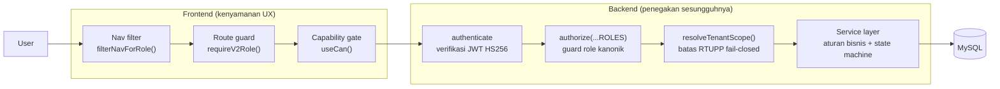
```mermaid
graph LR
    U["User"] --> L1
    subgraph FE["Frontend (kenyamanan UX)"]
        L1["Nav filter<br/>filterNavForRole()"] --> L2["Route guard<br/>requireV2Role()"] --> L3["Capability gate<br/>useCan()"]
    end
    L3 --> L4
    subgraph BE["Backend (penegakan sesungguhnya)"]
        L4["authenticate<br/>verifikasi JWT HS256"] --> L5["authorize(...ROLES)<br/>guard role kanonik"] --> L6["resolveTenantScope()<br/>batas RTUPP fail-closed"] --> L7["Service layer<br/>aturan bisnis + state machine"]
    end
    L7 --> DB[("MySQL")]
```

> **Prinsip:** Frontend menyembunyikan kontrol yang akan ditolak agar pengguna tidak menemui error 403. Namun, seluruh keputusan otorisasi tetap divalidasi ulang di server. Mem-bypass UI (misalnya memanggil API langsung) **tidak** memberikan akses tambahan.

---

## 5. Isolasi Data Multi-Tenant

### 5.1 Batas Tenant

Seluruh domain operasional (aset, inspeksi, HAR, tiket, dokumen, performa, work order, GIS) **berakar pada tabel `locations`** (gardu). Kolom `locations.rtuppId` adalah **satu-satunya batas tenant**.

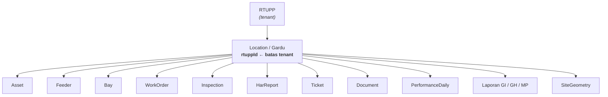
```mermaid
graph TB
    RT["RTUPP<br/><i>(tenant)</i>"] --> LOC["Location / Gardu<br/><b>rtuppId ← batas tenant</b>"]
    LOC --> AST["Asset"]
    LOC --> FEE["Feeder"]
    LOC --> BAY["Bay"]
    LOC --> WO["WorkOrder"]
    LOC --> INS["Inspection"]
    LOC --> HAR["HarReport"]
    LOC --> TIK["Ticket"]
    LOC --> DOC["Document"]
    LOC --> PER["PerformanceDaily"]
    LOC --> LAP["Laporan GI / GH / MP"]
    LOC --> GEO["SiteGeometry"]
```

### 5.2 Resolusi Scope (Fail-Closed)

`resolveTenantScope()` di `BE/src/utils/tenantScope.ts`:

| Role | rtuppId | Scope hasil |
|---|---|---|
| MASTER | apa pun | **GLOBAL** — akses audit pemilik sistem |
| ADMIN | apa pun | **GLOBAL** — kebijakan Juli 2026: hub operasional membaca seluruh RTUPP (khusus DATA; manajemen user tetap per-RTUPP) |
| NOC | `null` | **GLOBAL** — permukaan monitoring lokasi/SCADA/GIS saja |
| MANAGER | `null` | **GLOBAL** — Manager UP3, read-only |
| MANAGER | terisi | **DIBATASI** ke `rtuppId` tersebut — ASMEN |
| PETUGAS | terisi | **DIBATASI** ke `rtuppId` tersebut |
| Role apa pun yang seharusnya dibatasi | `null` | **DITOLAK** (`ForbiddenError`) — tidak pernah diam-diam menjadi global |

Scope diterjemahkan menjadi fragmen `where` Prisma yang **selalu di-spread** ke setiap query:

```ts
locationScopeWhere(scope)     // → {} bila global, { rtuppId } bila dibatasi
viaLocationScopeWhere(scope)  // → {} bila global, { location: { rtuppId } } bila dibatasi
```

> **Keunggulan desain:** karena fragmen selalu diterapkan, **lupa menangani kasus global tidak dapat memperluas akses** — nilai default adalah cabang yang membatasi. Ini kebalikan dari pola "tambahkan filter jika bukan admin" yang rawan bocor bila satu cabang terlewat.

### 5.3 Optimasi Indeks

Predikat scope dieksekusi pada setiap request. Indeks `idx_locations_rtupp` mengubah pemindaian penuh atas 15.000+ baris gardu menjadi index range scan. Indeks komposit `idx_locations_geo (latitude, longitude)` melayani query bbox peta GIS.

---

## 6. Model Data

### 6.1 Ikhtisar

**66 model Prisma / tabel MySQL**, dikelola melalui **47 migrasi terversioning**.

| Kelompok | Model |
|---|---|
| **Identitas & Auth** | `User`, `Role`, `RefreshToken`, `DeviceToken` |
| **Organisasi** | `Organization`, `Up3`, `RTUPP`, `Team`, `Personil` |
| **Registry Jaringan** | `Location`, `Feeder`, `Bay`, `SiteGeometry` |
| **Aset** | `Asset`, `AssetCategory`, `AssetTypeRef`, `AssetSimCard`, `CommunicationMedia` |
| **Work Order** | `WorkOrder`, `WorkOrderAttachment` |
| **Laporan Legacy (V1)** | `LaporanAwal`, `LaporanAkhir`, `Attachment`, `ReportValidation`, `ActivityLog` |
| **Laporan GI** | `LaporanGi`, `LaporanHarGi`, `LaporanGiAttachment` |
| **Laporan GH** | `LaporanInspeksiGh`, `LaporanHarGh`, + 2 tabel lampiran |
| **Laporan MP** | `LaporanInspeksiMp`, `LaporanHarMp`, + 2 tabel lampiran |
| **Inspeksi/HAR Generik** | `Inspection`, `InspectionFinding`, `InspectionPhoto`, `HarReport`, `HarDetail` |
| **Data Historis Import** | `InspeksiGarduRecord`, `HarGarduRecord` |
| **Dokumen & Laporan Cetak** | `Document`, `GeneratedReport`, `ReportSignature`, `ReportDownload` |
| **Import Engine** | `ImportJob`, `ImportError` |
| **SCADA** | `ScadaGardu`, `ScadaSnapshot`, `ScadaRtuRow`, `ScadaLineRow` |
| **Operasional Lain** | `Ticket`, `PerformanceDaily` |
| **Workflow & Notifikasi** | `WorkflowInstance`, `WorkflowTransition`, `Notification`, `NotificationDelivery`, `IdempotencyKey` |
| **Audit** | `AuditLog` |
| **AI** | `AiConversation`, `AiFeedback`, `AiUserPreference`, `AiAlias`, `AiIntent` |

### 6.2 ERD Inti — Organisasi & Registry

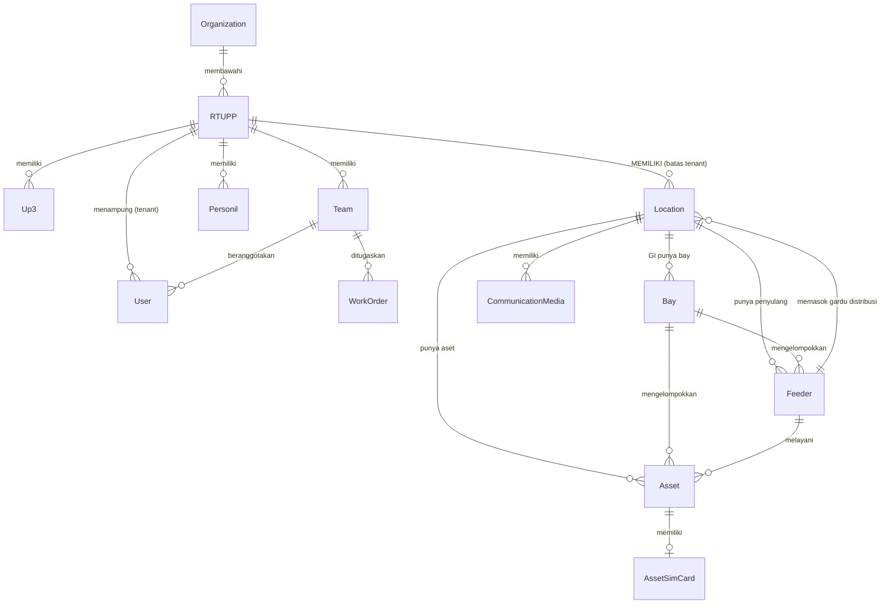
```mermaid
erDiagram
    Organization ||--o{ RTUPP : membawahi
    RTUPP ||--o{ Up3 : memiliki
    RTUPP ||--o{ User : "menampung (tenant)"
    RTUPP ||--o{ Team : memiliki
    RTUPP ||--o{ Personil : memiliki
    RTUPP ||--o{ Location : "MEMILIKI (batas tenant)"
    Team ||--o{ User : beranggotakan
    Team ||--o{ WorkOrder : ditugaskan

    Location ||--o{ Bay : "GI punya bay"
    Location ||--o{ Feeder : "punya penyulang"
    Location ||--o{ Asset : "punya aset"
    Bay ||--o{ Feeder : mengelompokkan
    Bay ||--o{ Asset : mengelompokkan
    Feeder ||--o{ Asset : melayani
    Feeder ||--o{ Location : "memasok gardu distribusi"
    Asset ||--o| AssetSimCard : memiliki
    Location ||--o{ CommunicationMedia : memiliki
```

### 6.3 ERD Inti — Alur Operasional

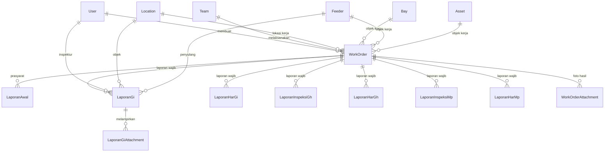
```mermaid
erDiagram
    User ||--o{ WorkOrder : membuat
    Team ||--o{ WorkOrder : melaksanakan
    Location ||--o{ WorkOrder : "lokasi kerja"
    Bay ||--o{ WorkOrder : "objek kerja"
    Feeder ||--o{ WorkOrder : "objek kerja"
    Asset ||--o{ WorkOrder : "objek kerja"

    WorkOrder ||--o{ LaporanAwal : "prasyarat"
    WorkOrder ||--o{ LaporanGi : "laporan wajib"
    WorkOrder ||--o{ LaporanHarGi : "laporan wajib"
    WorkOrder ||--o{ LaporanInspeksiGh : "laporan wajib"
    WorkOrder ||--o{ LaporanHarGh : "laporan wajib"
    WorkOrder ||--o{ LaporanInspeksiMp : "laporan wajib"
    WorkOrder ||--o{ LaporanHarMp : "laporan wajib"
    WorkOrder ||--o{ WorkOrderAttachment : "foto hasil"

    LaporanGi ||--o{ LaporanGiAttachment : melampirkan
    User ||--o{ LaporanGi : "inspektur"
    Location ||--o{ LaporanGi : "objek"
    Feeder ||--o{ LaporanGi : "penyulang"
```

### 6.4 Enum Status Utama

| Enum | Nilai | Digunakan oleh |
|---|---|---|
| `UserRole` | MASTER, MANAGER, SUPERADMIN\*, ADMIN, ADMIN_RTUPP\*, PETUGAS, NOC | `User.role` (\*legacy, dinormalisasi) |
| `WorkOrderStatus` | DRAFT, ASSIGNED, ON_PROGRESS, WAITING_APPROVAL, APPROVED, REJECTED, CLOSED | Work Order |
| `WorkOrderType` | CORRECTIVE, PREVENTIVE | Work Order |
| `GiReportStatus` | DRAFT, SUBMITTED, VALIDATED, REJECTED | Seluruh laporan GI/GH/MP |
| `ReportStatus` | DRAFT, PENDING, APPROVED, REJECTED, REVISED | Laporan legacy V1 |
| `WorkflowState` | DRAFT, SUBMITTED, REVIEWED, REVISION_REQUIRED, APPROVED, REJECTED, CLOSED | Engine workflow generik |
| `WorkResult` | BERHASIL, GAGAL | Hasil RC / LR / ES pada Laporan WO |
| `CbStatus` | NORMAL, TIDAK_NORMAL | Status CB pada Laporan WO |
| `ChecklistCondition` | NORMAL, ABNORMAL, TIDAK_BEROPERASI | Checklist inspeksi (3-state) |
| `LocationType` | GI, GH, GARDU | Jenis gardu |
| `AssetType` | RTU, FDI, RECTIFIER, BATTERY_BANK, ROUTER, MODEM, RADIO | Klasifikasi aset |
| `AssetStatus` | ACTIVE, WARNING, DAMAGED, RETIRED | Kondisi aset |
| `ScadaStatus` | IN_SCAN, OOP | Status RTU pada snapshot SP7 |
| `TicketStatus` | OPEN, ASSIGNED, IN_PROGRESS, RESOLVED, CLOSED | Tiket |
| `NotificationType` | TASK_ASSIGNED, REPORT_SUBMITTED, REPORT_APPROVED, REPORT_REJECTED, REVISION_REQUESTED, TICKET_CREATED, TICKET_CLOSED | Notifikasi |
| `AuditAction` | CREATE, UPDATE, DELETE, STATUS_CHANGE | Audit trail V2 |

---

## 7. Use Case

### 7.1 Diagram Use Case


```mermaid
graph LR
    PT(("PETUGAS"))
    AD(("ADMIN"))
    MG(("MANAGER"))
    MS(("MASTER"))
    NC(("NOC"))

    subgraph UC_Lapangan["Pelaporan Lapangan"]
        U1["UC-01 Login & autentikasi"]
        U2["UC-02 Lihat WO yang ditugaskan"]
        U3["UC-03 Isi Laporan Awal"]
        U4["UC-04 Mulai pengerjaan WO"]
        U5["UC-05 Isi laporan domain<br/>(GI / GH / MP)"]
        U6["UC-06 Unggah foto & video"]
        U7["UC-07 Ajukan WO untuk approval"]
        U8["UC-08 Bekerja offline & sinkron"]
        U9["UC-09 Lihat riwayat laporan"]
    end

    subgraph UC_Ops["Operasional & Approval"]
        U10["UC-10 Terbitkan & tugaskan WO"]
        U11["UC-11 Tetapkan laporan wajib"]
        U12["UC-12 Approve / reject laporan"]
        U13["UC-13 Approve / reject / close WO"]
        U14["UC-14 CRUD gardu/penyulang/bay/aset"]
        U15["UC-15 Import data Excel"]
        U16["UC-16 Kelola personil"]
        U17["UC-17 Generate dokumen PDF/Excel"]
    end

    subgraph UC_Monitor["Monitoring"]
        U18["UC-18 Dashboard KPI & lapangan"]
        U19["UC-19 Monitoring GIS peta"]
        U20["UC-20 Dashboard SCADA Inscan/OOP"]
        U21["UC-21 Monitoring seluruh laporan"]
        U22["UC-22 Tanya AI Assistant"]
    end

    subgraph UC_SCADA["SCADA"]
        U23["UC-23 Upload snapshot SP7 harian"]
        U24["UC-24 Lihat status kanal IFS Lines"]
    end

    subgraph UC_Sistem["Administrasi Sistem"]
        U25["UC-25 Kelola akun pengguna"]
        U26["UC-26 Kelola RTUPP & tim"]
        U27["UC-27 Telaah audit log"]
        U28["UC-28 Verifikasi keaslian dokumen (publik)"]
    end

    PT --> U1 & U2 & U3 & U4 & U5 & U6 & U7 & U8 & U9 & U19 & U20
    AD --> U1 & U10 & U11 & U12 & U13 & U14 & U15 & U16 & U17 & U18 & U19 & U20 & U21 & U22
    MG --> U1 & U18 & U19 & U20 & U21 & U22 & U23 & U24
    MS --> U1 & U18 & U19 & U20 & U21 & U22 & U23 & U25 & U26 & U27
    NC --> U1 & U19 & U20 & U23 & U24
```

### 7.2 Spesifikasi Use Case Utama

#### UC-10 — Terbitkan & Tugaskan Work Order

| | |
|---|---|
| **Aktor utama** | ADMIN |
| **Prasyarat** | Aktor terautentikasi; gardu (Location) sudah terdaftar; tim tersedia |
| **Pemicu** | Terdapat pekerjaan preventif terjadwal atau korektif akibat event SCADA |
| **Alur utama** | 1. ADMIN membuka `/work-order` → "Buat WO"<br/>2. Sistem menampilkan form: tipe (PREVENTIVE/CORRECTIVE), prioritas, judul, deskripsi, lokasi, bay/penyulang/aset (opsional), tim pelaksana, tanggal jatuh tempo<br/>3. ADMIN mencentang **laporan wajib** (`requiredReports`) sesuai jenis lokasi<br/>4. Sistem memvalidasi kecocokan laporan wajib dengan tipe lokasi<br/>5. Sistem membuat WO dengan nomor unik, status `ASSIGNED`<br/>6. Sistem mengirim notifikasi `TASK_ASSIGNED` ke anggota tim |
| **Alur alternatif** | 4a. Laporan wajib tidak cocok dengan tipe lokasi → error validasi, WO tidak dibuat |
| **Pascakondisi** | WO berstatus `ASSIGNED`, tampil di daftar "WO Saya" milik petugas tim |
| **Aturan bisnis** | Hanya ADMIN yang boleh menerbitkan WO; kombinasi laporan wajib dibatasi ke {GI, HAR, INSPEKSI_GH, HAR_GH, INSPEKSI_MP, HAR_MP} |

#### UC-05 — Isi Laporan Domain

| | |
|---|---|
| **Aktor utama** | PETUGAS |
| **Prasyarat** | WO berstatus `ON_PROGRESS`; **Laporan Awal WO tersebut sudah dikirim (bukan DRAFT)** |
| **Alur utama** | 1. Petugas membuka WO → memilih laporan wajib yang belum terisi<br/>2. Sistem memeriksa gate `assertLaporanAwalSubmitted()`<br/>3. Sistem menampilkan form multi-section (header ter-prefill dari WO, read-only)<br/>4. Petugas mengisi checklist 3-state, nilai ukur, grid relay, kubikel per penyulang (GH)<br/>5. Petugas melampirkan foto/video/SLD/logger<br/>6. Petugas menyimpan sebagai `DRAFT` atau langsung `SUBMITTED` |
| **Alur alternatif** | 2a. Laporan Awal belum dikirim → ditolak dengan pesan "Isi Laporan Awal terlebih dahulu"<br/>6a. Tidak ada koneksi → laporan masuk antrean offline dengan `X-Idempotency-Key` |
| **Pascakondisi** | Laporan berstatus `SUBMITTED`, masuk antrean approval ADMIN |
| **Aturan bisnis** | `reportDate` tidak boleh di masa depan; pembuatan laporan **hanya** lewat WO (jalur mandiri sudah dicabut) |

#### UC-23 — Upload Snapshot SCADA Harian

| | |
|---|---|
| **Aktor utama** | NOC (cadangan: MASTER, MANAGER) |
| **Prasyarat** | Tersedia file export harian Siemens SP7 (`csd_IFS-IFS RTUs` / `Lines`) |
| **Alur utama** | 1. NOC membuka `/scada-upload`<br/>2. Mengunggah file .xlsx<br/>3. Sistem mem-parsing dan memvalidasi struktur<br/>4. Sistem membuat `ScadaSnapshot` baru dan mengisi `ScadaRtuRow` / `ScadaLineRow` dengan **semantik replace** (snapshot terbaru menggantikan yang lama sebagai sumber angka)<br/>5. Dashboard Inscan/OOP dan RC dihitung ulang dari snapshot terbaru |
| **Pascakondisi** | Angka Inscan/OOP di seluruh dashboard mencerminkan snapshot terbaru |
| **Aturan bisnis** | Perhitungan Inscan/OOP dilakukan dengan **menghitung baris** `scada_rtu_rows`, bukan membaca header total pada file (header dapat keliru) |

---

## 8. Alur Bisnis End-to-End

### 8.1 Alur Operasional Utama

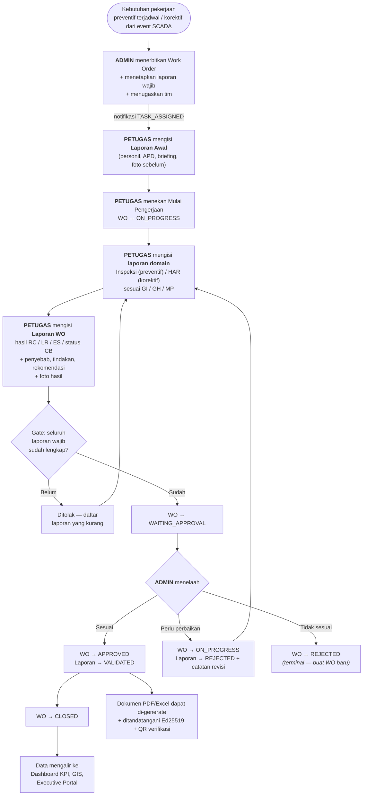
```mermaid
flowchart TB
    START(["Kebutuhan pekerjaan<br/>preventif terjadwal / korektif dari event SCADA"])

    START --> WO1["<b>ADMIN</b> menerbitkan Work Order<br/>+ menetapkan laporan wajib<br/>+ menugaskan tim"]
    WO1 -->|"notifikasi TASK_ASSIGNED"| LA["<b>PETUGAS</b> mengisi <b>Laporan Awal</b><br/>(personil, APD, briefing, foto sebelum)"]
    LA --> ST["<b>PETUGAS</b> menekan Mulai Pengerjaan<br/>WO → ON_PROGRESS"]
    ST --> LD["<b>PETUGAS</b> mengisi <b>laporan domain</b><br/>Inspeksi (preventif) / HAR (korektif)<br/>sesuai GI / GH / MP"]
    LD --> LWO["<b>PETUGAS</b> mengisi <b>Laporan WO</b><br/>hasil RC / LR / ES / status CB<br/>+ penyebab, tindakan, rekomendasi<br/>+ foto hasil"]
    LWO --> SUB{"Gate: seluruh<br/>laporan wajib<br/>sudah lengkap?"}
    SUB -->|"Belum"| BLOCK["Ditolak — daftar<br/>laporan yang kurang"]
    BLOCK --> LD
    SUB -->|"Sudah"| WA["WO → WAITING_APPROVAL"]
    WA --> APP{"<b>ADMIN</b> menelaah"}
    APP -->|"Sesuai"| OK["WO → APPROVED<br/>Laporan → VALIDATED"]
    APP -->|"Perlu perbaikan"| REV["WO → ON_PROGRESS<br/>Laporan → REJECTED + catatan revisi"]
    APP -->|"Tidak sesuai"| REJ["WO → REJECTED<br/><i>(terminal — buat WO baru)</i>"]
    REV --> LD
    OK --> CLS["WO → CLOSED"]
    CLS --> DASH["Data mengalir ke<br/>Dashboard KPI, GIS,<br/>Executive Portal"]
    OK --> GEN["Dokumen PDF/Excel dapat di-generate<br/>+ ditandatangani Ed25519 + QR verifikasi"]
```

### 8.2 State Machine Work Order

Sumber: `BE/src/modules/work-orders/work-order.transitions.ts` — murni data + guard, teruji unit secara terpisah.

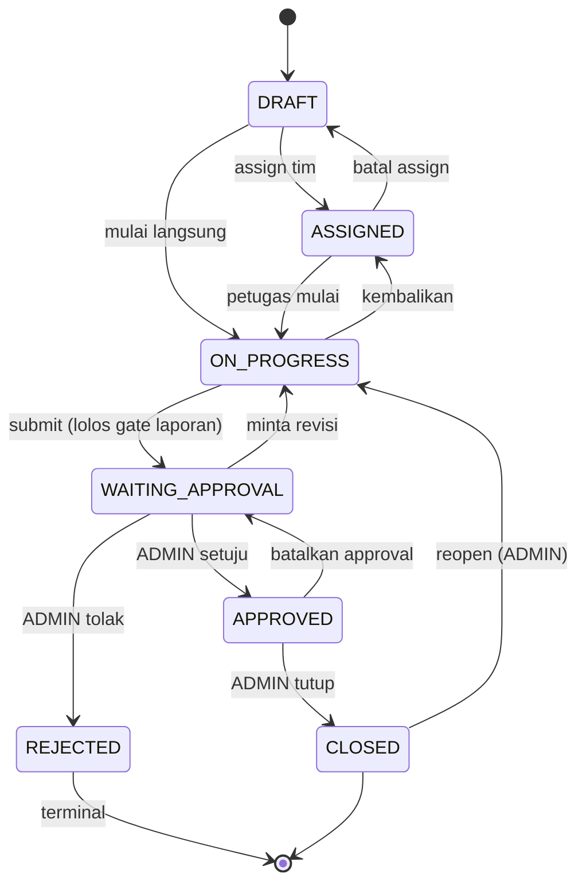
```mermaid
stateDiagram-v2
    [*] --> DRAFT
    DRAFT --> ASSIGNED : assign tim
    DRAFT --> ON_PROGRESS : mulai langsung
    ASSIGNED --> ON_PROGRESS : petugas mulai
    ASSIGNED --> DRAFT : batal assign
    ON_PROGRESS --> WAITING_APPROVAL : submit (lolos gate laporan)
    ON_PROGRESS --> ASSIGNED : kembalikan
    WAITING_APPROVAL --> APPROVED : ADMIN setuju
    WAITING_APPROVAL --> REJECTED : ADMIN tolak
    WAITING_APPROVAL --> ON_PROGRESS : minta revisi
    APPROVED --> CLOSED : ADMIN tutup
    APPROVED --> WAITING_APPROVAL : batalkan approval
    CLOSED --> ON_PROGRESS : reopen (ADMIN)
    REJECTED --> [*] : terminal
    CLOSED --> [*]
```

> **Catatan:** `REJECTED` bersifat **terminal** dan tidak memiliki jalan keluar. Kunjungan ulang berarti menerbitkan WO baru, bukan membuka kembali WO lama — sehingga riwayat penolakan tidak pernah kabur.

### 8.3 State Machine Laporan Domain

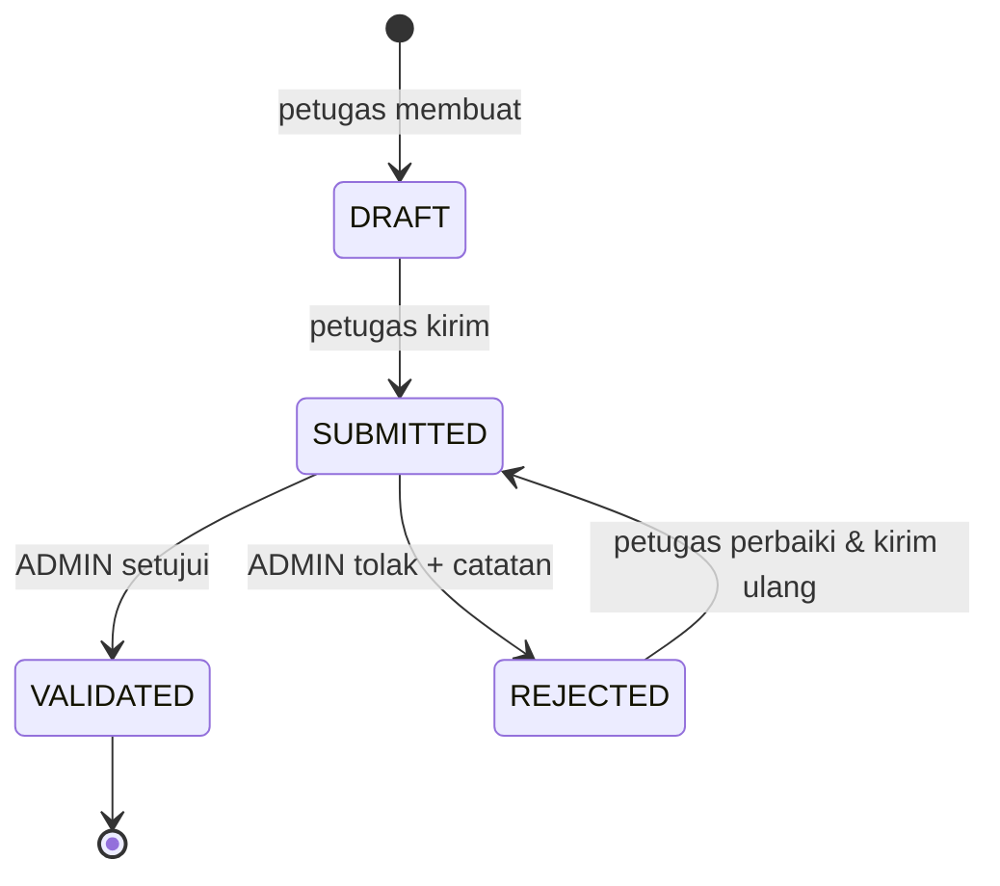
```mermaid
stateDiagram-v2
    [*] --> DRAFT : petugas membuat
    DRAFT --> SUBMITTED : petugas kirim
    SUBMITTED --> VALIDATED : ADMIN setujui
    SUBMITTED --> REJECTED : ADMIN tolak + catatan
    REJECTED --> SUBMITTED : petugas perbaiki & kirim ulang
    VALIDATED --> [*]
```

Aturan tulis: PETUGAS hanya dapat mengedit/menghapus laporan berstatus `DRAFT` dan `PENDING`/`SUBMITTED` miliknya sendiri.

### 8.4 Alur Data SCADA

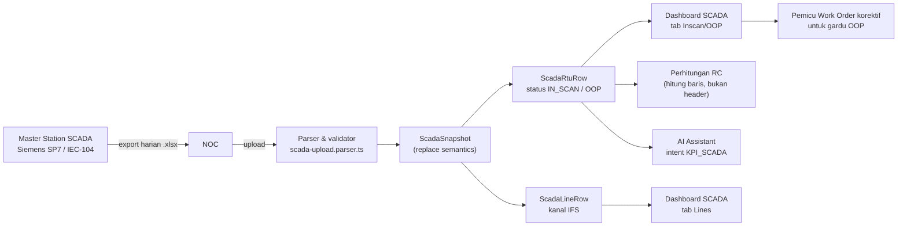
```mermaid
flowchart LR
    MS["Master Station SCADA<br/>Siemens SP7 / IEC-104"] -->|"export harian .xlsx"| NOC["NOC"]
    NOC -->|"upload"| PARSE["Parser & validator<br/>scada-upload.parser.ts"]
    PARSE --> SNAP["ScadaSnapshot<br/>(replace semantics)"]
    SNAP --> RTU["ScadaRtuRow<br/>status IN_SCAN / OOP"]
    SNAP --> LINE["ScadaLineRow<br/>kanal IFS"]
    RTU --> D1["Dashboard SCADA<br/>tab Inscan/OOP"]
    RTU --> D2["Perhitungan RC<br/>(hitung baris, bukan header)"]
    LINE --> D3["Dashboard SCADA<br/>tab Lines"]
    RTU --> AI["AI Assistant<br/>intent KPI_SCADA"]
    D1 --> WO["Pemicu Work Order korektif<br/>untuk gardu OOP"]
```

### 8.5 Alur Offline (Tim Lapangan)

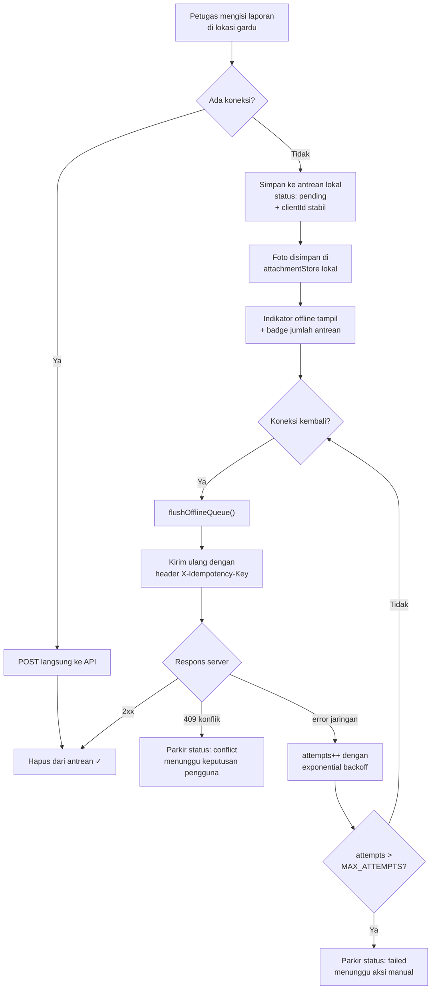
```mermaid
flowchart TB
    A["Petugas mengisi laporan<br/>di lokasi gardu"] --> B{"Ada koneksi?"}
    B -->|"Ya"| C["POST langsung ke API"]
    B -->|"Tidak"| D["Simpan ke antrean lokal<br/>status: pending<br/>+ clientId stabil"]
    D --> E["Foto disimpan di<br/>attachmentStore lokal"]
    E --> F["Indikator offline tampil<br/>+ badge jumlah antrean"]
    F --> G{"Koneksi kembali?"}
    G -->|"Ya"| H["flushOfflineQueue()"]
    H --> I["Kirim ulang dengan<br/>header X-Idempotency-Key"]
    I --> J{"Respons server"}
    J -->|"2xx"| K["Hapus dari antrean ✓"]
    J -->|"409 konflik"| L["Parkir status: conflict<br/>menunggu keputusan pengguna"]
    J -->|"error jaringan"| M["attempts++ dengan<br/>exponential backoff"]
    M --> N{"attempts ><br/>MAX_ATTEMPTS?"}
    N -->|"Ya"| O["Parkir status: failed<br/>menunggu aksi manual"]
    N -->|"Tidak"| G
    C --> K
```

---

## 9. Sequence Diagram

### 9.1 Autentikasi & Rotasi Token

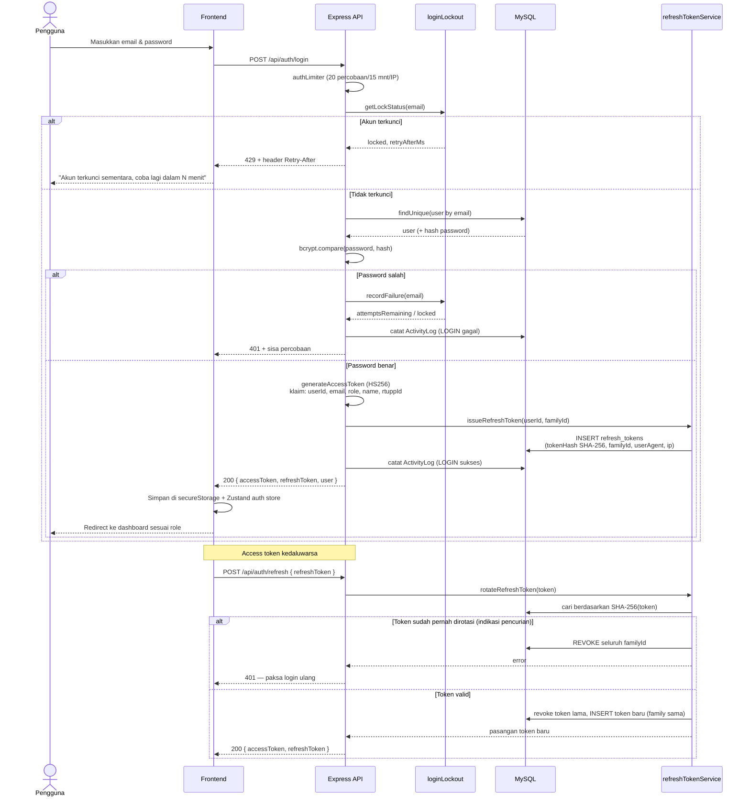
```mermaid
sequenceDiagram
    actor U as Pengguna
    participant FE as Frontend
    participant API as Express API
    participant LL as loginLockout
    participant DB as MySQL
    participant RT as refreshTokenService

    U->>FE: Masukkan email & password
    FE->>API: POST /api/auth/login
    API->>API: authLimiter (20 percobaan/15 mnt/IP)
    API->>LL: getLockStatus(email)

    alt Akun terkunci
        LL-->>API: locked, retryAfterMs
        API-->>FE: 429 + header Retry-After
        FE-->>U: "Akun terkunci sementara, coba lagi dalam N menit"
    else Tidak terkunci
        API->>DB: findUnique(user by email)
        DB-->>API: user (+ hash password)
        API->>API: bcrypt.compare(password, hash)

        alt Password salah
            API->>LL: recordFailure(email)
            LL-->>API: attemptsRemaining / locked
            API->>DB: catat ActivityLog (LOGIN gagal)
            API-->>FE: 401 + sisa percobaan
        else Password benar
            API->>API: generateAccessToken (HS256)<br/>klaim: userId, email, role, name, rtuppId
            API->>RT: issueRefreshToken(userId, familyId)
            RT->>DB: INSERT refresh_tokens<br/>(tokenHash SHA-256, familyId, userAgent, ip)
            API->>DB: catat ActivityLog (LOGIN sukses)
            API-->>FE: 200 { accessToken, refreshToken, user }
            FE->>FE: Simpan di secureStorage + Zustand auth store
            FE-->>U: Redirect ke dashboard sesuai role
        end
    end

    Note over FE,API: Access token kedaluwarsa

    FE->>API: POST /api/auth/refresh { refreshToken }
    API->>RT: rotateRefreshToken(token)
    RT->>DB: cari berdasarkan SHA-256(token)

    alt Token sudah pernah dirotasi (indikasi pencurian)
        RT->>DB: REVOKE seluruh familyId
        RT-->>API: error
        API-->>FE: 401 — paksa login ulang
    else Token valid
        RT->>DB: revoke token lama, INSERT token baru (family sama)
        RT-->>API: pasangan token baru
        API-->>FE: 200 { accessToken, refreshToken }
    end
```

### 9.2 Penerbitan Work Order & Penugasan

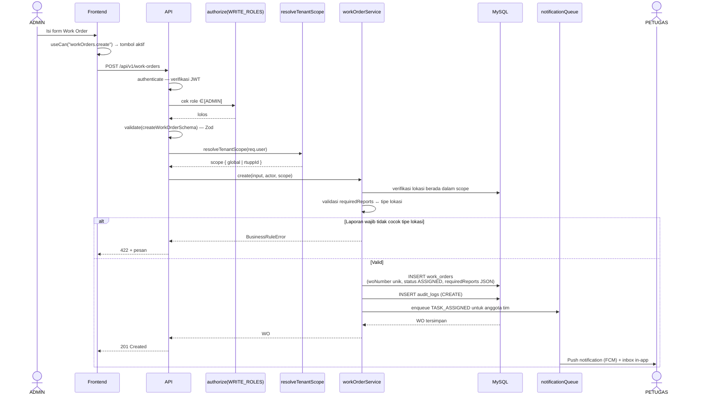
```mermaid
sequenceDiagram
    actor AD as ADMIN
    participant FE as Frontend
    participant API as API
    participant RBAC as authorize(WRITE_ROLES)
    participant SC as resolveTenantScope
    participant SVC as workOrderService
    participant DB as MySQL
    participant NQ as notificationQueue
    actor PT as PETUGAS

    AD->>FE: Isi form Work Order
    FE->>FE: useCan("workOrders.create") → tombol aktif
    FE->>API: POST /api/v1/work-orders
    API->>API: authenticate — verifikasi JWT
    API->>RBAC: cek role ∈ [ADMIN]
    RBAC-->>API: lolos
    API->>API: validate(createWorkOrderSchema) — Zod
    API->>SC: resolveTenantScope(req.user)
    SC-->>API: scope { global | rtuppId }
    API->>SVC: create(input, actor, scope)
    SVC->>DB: verifikasi lokasi berada dalam scope
    SVC->>SVC: validasi requiredReports ↔ tipe lokasi

    alt Laporan wajib tidak cocok tipe lokasi
        SVC-->>API: BusinessRuleError
        API-->>FE: 422 + pesan
    else Valid
        SVC->>DB: INSERT work_orders<br/>(woNumber unik, status ASSIGNED, requiredReports JSON)
        SVC->>DB: INSERT audit_logs (CREATE)
        SVC->>NQ: enqueue TASK_ASSIGNED untuk anggota tim
        DB-->>SVC: WO tersimpan
        SVC-->>API: WO
        API-->>FE: 201 Created
        NQ->>PT: Push notification (FCM) + inbox in-app
    end
```

### 9.3 Eksekusi WO oleh Petugas & Gate Laporan Wajib

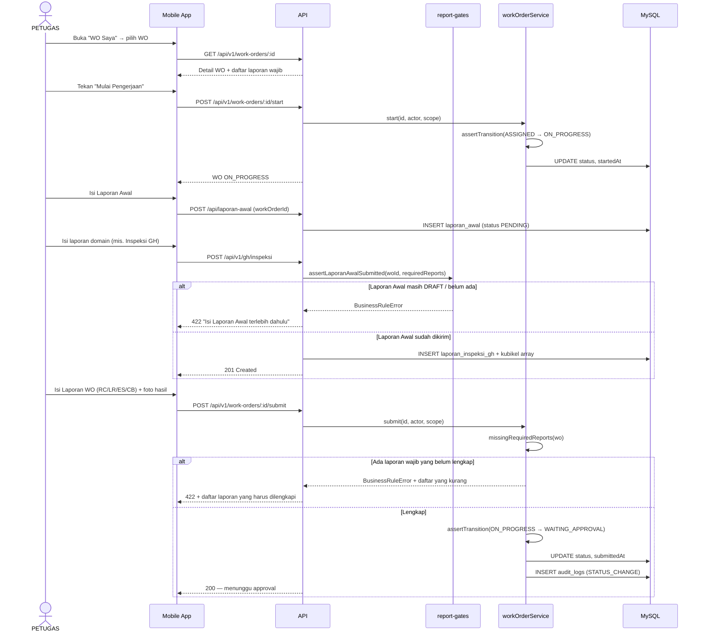
```mermaid
sequenceDiagram
    actor PT as PETUGAS
    participant FE as Mobile App
    participant API as API
    participant GATE as report-gates
    participant SVC as workOrderService
    participant DB as MySQL

    PT->>FE: Buka "WO Saya" → pilih WO
    FE->>API: GET /api/v1/work-orders/:id
    API-->>FE: Detail WO + daftar laporan wajib

    PT->>FE: Tekan "Mulai Pengerjaan"
    FE->>API: POST /api/v1/work-orders/:id/start
    API->>SVC: start(id, actor, scope)
    SVC->>SVC: assertTransition(ASSIGNED → ON_PROGRESS)
    SVC->>DB: UPDATE status, startedAt
    API-->>FE: WO ON_PROGRESS

    PT->>FE: Isi Laporan Awal
    FE->>API: POST /api/laporan-awal (workOrderId)
    API->>DB: INSERT laporan_awal (status PENDING)

    PT->>FE: Isi laporan domain (mis. Inspeksi GH)
    FE->>API: POST /api/v1/gh/inspeksi
    API->>GATE: assertLaporanAwalSubmitted(woId, requiredReports)

    alt Laporan Awal masih DRAFT / belum ada
        GATE-->>API: BusinessRuleError
        API-->>FE: 422 "Isi Laporan Awal terlebih dahulu"
    else Laporan Awal sudah dikirim
        API->>DB: INSERT laporan_inspeksi_gh + kubikel array
        API-->>FE: 201 Created
    end

    PT->>FE: Isi Laporan WO (RC/LR/ES/CB) + foto hasil
    FE->>API: POST /api/v1/work-orders/:id/submit
    API->>SVC: submit(id, actor, scope)
    SVC->>SVC: missingRequiredReports(wo)

    alt Ada laporan wajib yang belum lengkap
        SVC-->>API: BusinessRuleError + daftar yang kurang
        API-->>FE: 422 + daftar laporan yang harus dilengkapi
    else Lengkap
        SVC->>SVC: assertTransition(ON_PROGRESS → WAITING_APPROVAL)
        SVC->>DB: UPDATE status, submittedAt
        SVC->>DB: INSERT audit_logs (STATUS_CHANGE)
        API-->>FE: 200 — menunggu approval
    end
```

### 9.4 Approval Laporan & Work Order

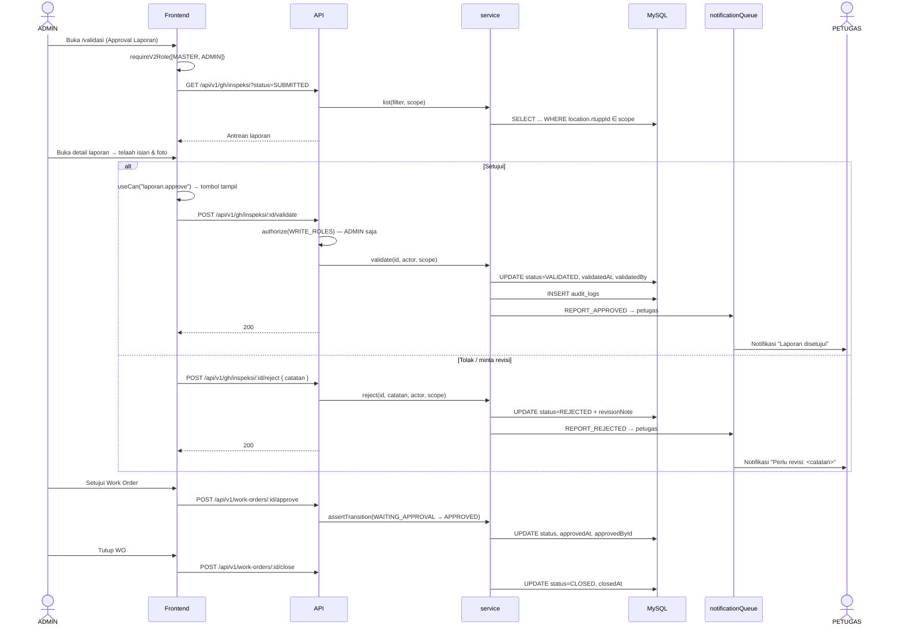
```mermaid
sequenceDiagram
    actor AD as ADMIN
    participant FE as Frontend
    participant API as API
    participant SVC as service
    participant DB as MySQL
    participant NQ as notificationQueue
    actor PT as PETUGAS

    AD->>FE: Buka /validasi (Approval Laporan)
    FE->>FE: requireV2Role([MASTER, ADMIN])
    FE->>API: GET /api/v1/gh/inspeksi?status=SUBMITTED
    API->>SVC: list(filter, scope)
    SVC->>DB: SELECT ... WHERE location.rtuppId ∈ scope
    API-->>FE: Antrean laporan

    AD->>FE: Buka detail laporan → telaah isian & foto

    alt Setujui
        FE->>FE: useCan("laporan.approve") → tombol tampil
        FE->>API: POST /api/v1/gh/inspeksi/:id/validate
        API->>API: authorize(WRITE_ROLES) — ADMIN saja
        API->>SVC: validate(id, actor, scope)
        SVC->>DB: UPDATE status=VALIDATED, validatedAt, validatedBy
        SVC->>DB: INSERT audit_logs
        SVC->>NQ: REPORT_APPROVED → petugas
        API-->>FE: 200
        NQ->>PT: Notifikasi "Laporan disetujui"
    else Tolak / minta revisi
        FE->>API: POST /api/v1/gh/inspeksi/:id/reject { catatan }
        API->>SVC: reject(id, catatan, actor, scope)
        SVC->>DB: UPDATE status=REJECTED + revisionNote
        SVC->>NQ: REPORT_REJECTED → petugas
        API-->>FE: 200
        NQ->>PT: Notifikasi "Perlu revisi: <catatan>"
    end

    AD->>FE: Setujui Work Order
    FE->>API: POST /api/v1/work-orders/:id/approve
    API->>SVC: assertTransition(WAITING_APPROVAL → APPROVED)
    SVC->>DB: UPDATE status, approvedAt, approvedById
    AD->>FE: Tutup WO
    FE->>API: POST /api/v1/work-orders/:id/close
    SVC->>DB: UPDATE status=CLOSED, closedAt
```

### 9.5 Sinkronisasi Offline dengan Jaminan Anti-Duplikat

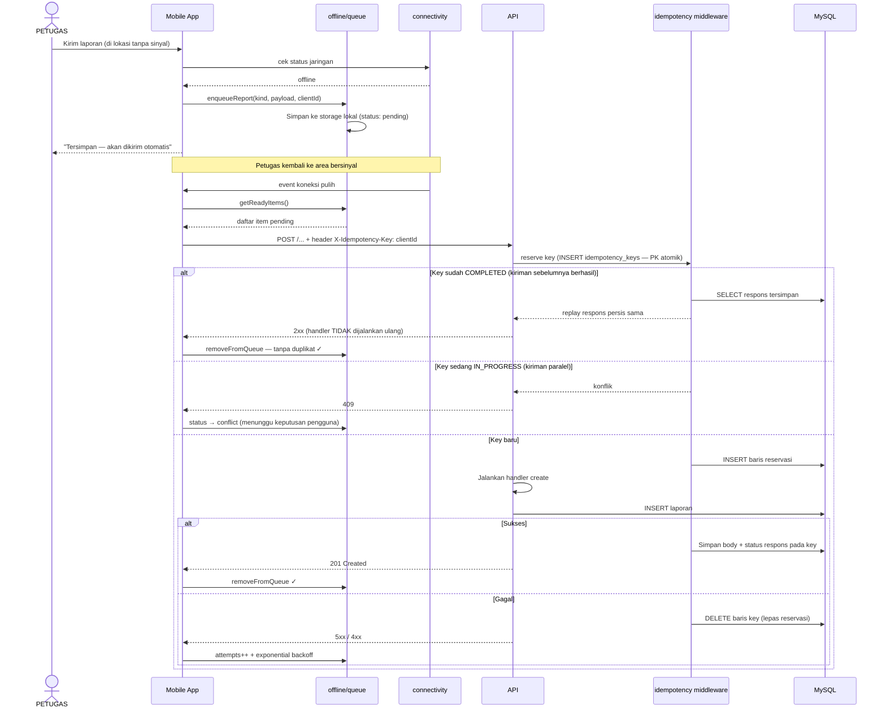
```mermaid
sequenceDiagram
    actor PT as PETUGAS
    participant APP as Mobile App
    participant Q as offline/queue
    participant NET as connectivity
    participant API as API
    participant IDM as idempotency middleware
    participant DB as MySQL

    PT->>APP: Kirim laporan (di lokasi tanpa sinyal)
    APP->>NET: cek status jaringan
    NET-->>APP: offline
    APP->>Q: enqueueReport(kind, payload, clientId)
    Q->>Q: Simpan ke storage lokal (status: pending)
    APP-->>PT: "Tersimpan — akan dikirim otomatis"

    Note over APP,NET: Petugas kembali ke area bersinyal

    NET->>APP: event koneksi pulih
    APP->>Q: getReadyItems()
    Q-->>APP: daftar item pending
    APP->>API: POST /... + header X-Idempotency-Key: clientId
    API->>IDM: reserve key (INSERT idempotency_keys — PK atomik)

    alt Key sudah COMPLETED (kiriman sebelumnya berhasil)
        IDM->>DB: SELECT respons tersimpan
        IDM-->>API: replay respons persis sama
        API-->>APP: 2xx (handler TIDAK dijalankan ulang)
        APP->>Q: removeFromQueue — tanpa duplikat ✓
    else Key sedang IN_PROGRESS (kiriman paralel)
        IDM-->>API: konflik
        API-->>APP: 409
        APP->>Q: status → conflict (menunggu keputusan pengguna)
    else Key baru
        IDM->>DB: INSERT baris reservasi
        API->>API: Jalankan handler create
        API->>DB: INSERT laporan
        alt Sukses
            IDM->>DB: Simpan body + status respons pada key
            API-->>APP: 201 Created
            APP->>Q: removeFromQueue ✓
        else Gagal
            IDM->>DB: DELETE baris key (lepas reservasi)
            API-->>APP: 5xx / 4xx
            APP->>Q: attempts++ + exponential backoff
        end
    end
```

### 9.6 Generate Dokumen & Tanda Tangan Digital

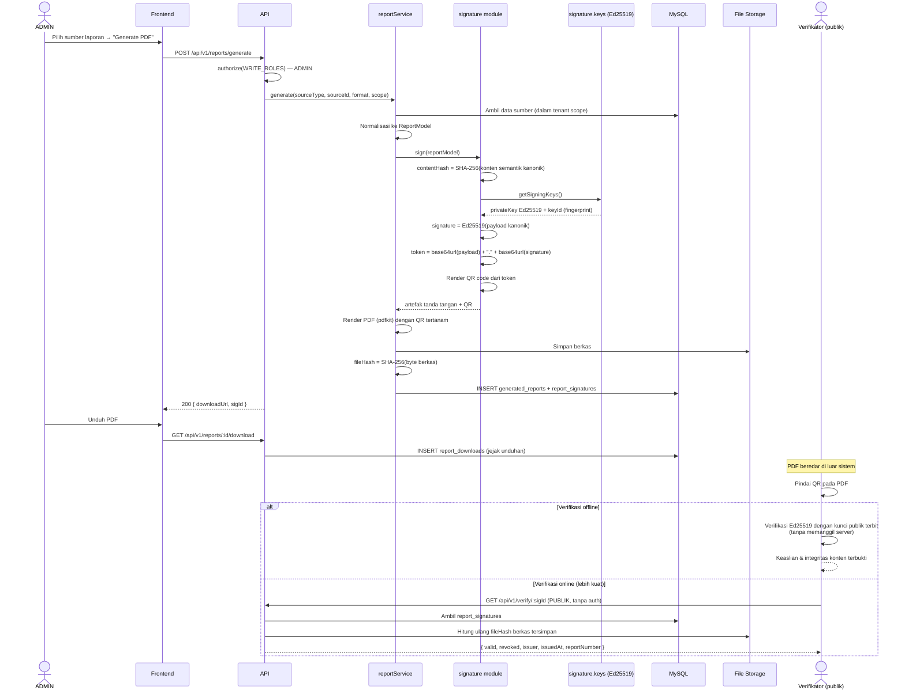
```mermaid
sequenceDiagram
    actor AD as ADMIN
    participant FE as Frontend
    participant API as API
    participant SVC as reportService
    participant SIG as signature module
    participant KEY as signature.keys (Ed25519)
    participant DB as MySQL
    participant FS as File Storage
    actor V as Verifikator (publik)

    AD->>FE: Pilih sumber laporan → "Generate PDF"
    FE->>API: POST /api/v1/reports/generate
    API->>API: authorize(WRITE_ROLES) — ADMIN
    API->>SVC: generate(sourceType, sourceId, format, scope)
    SVC->>DB: Ambil data sumber (dalam tenant scope)
    SVC->>SVC: Normalisasi ke ReportModel
    SVC->>SIG: sign(reportModel)
    SIG->>SIG: contentHash = SHA-256(konten semantik kanonik)
    SIG->>KEY: getSigningKeys()
    KEY-->>SIG: privateKey Ed25519 + keyId (fingerprint)
    SIG->>SIG: signature = Ed25519(payload kanonik)
    SIG->>SIG: token = base64url(payload) + "." + base64url(signature)
    SIG->>SIG: Render QR code dari token
    SIG-->>SVC: artefak tanda tangan + QR
    SVC->>SVC: Render PDF (pdfkit) dengan QR tertanam
    SVC->>FS: Simpan berkas
    SVC->>SVC: fileHash = SHA-256(byte berkas)
    SVC->>DB: INSERT generated_reports + report_signatures
    API-->>FE: 200 { downloadUrl, sigId }
    AD->>FE: Unduh PDF
    FE->>API: GET /api/v1/reports/:id/download
    API->>DB: INSERT report_downloads (jejak unduhan)

    Note over V: PDF beredar di luar sistem

    V->>V: Pindai QR pada PDF
    alt Verifikasi offline
        V->>V: Verifikasi Ed25519 dengan kunci publik terbit<br/>(tanpa memanggil server)
        V-->>V: Keaslian & integritas konten terbukti
    else Verifikasi online (lebih kuat)
        V->>API: GET /api/v1/verify/:sigId (PUBLIK, tanpa auth)
        API->>DB: Ambil report_signatures
        API->>FS: Hitung ulang fileHash berkas tersimpan
        API-->>V: { valid, revoked, issuer, issuedAt, reportNumber }
    end
```

### 9.7 AI Assistant dengan Penegakan RBAC

```mermaid
sequenceDiagram
    actor U as Pengguna
    participant FAB as AI Floating Button
    participant PXY as groq-proxy (BE)
    participant LLM as Claude API
    participant BR as AI Brain
    participant PG as prompt-guard
    participant QR as Allowed Query Registry
    participant QS as query-services
    participant DB as MySQL

    U->>FAB: "Berapa gardu OOP di RTUPP 2?"
    FAB->>PXY: POST /api/v1/ai/groq-proxy
    PXY->>LLM: Teruskan (translasi OpenAI ⇄ Anthropic)
    LLM-->>PXY: tool_use: query_volthub_data
    PXY->>BR: POST /api/v1/ai/brain
    BR->>PG: Skrining prompt injection (deterministik)

    alt Terdeteksi injeksi / SQL mentah / role hijack
        PG-->>BR: blocked + alasan
        BR->>DB: Catat ai-audit
        BR-->>PXY: Penolakan sopan
    else Lolos
        BR->>BR: Deteksi intent + skor confidence
        alt Confidence rendah / ambigu
            BR-->>PXY: Pertanyaan klarifikasi
        else Intent jelas
            BR->>QR: Cari queryId di registry
            QR->>QR: Cek allowedRoles ∋ role pemanggil

            alt Role tidak diizinkan untuk query ini
                QR-->>BR: Ditolak
                BR-->>PXY: "Anda tidak memiliki akses ke data tersebut"
            else Diizinkan
                QR->>QS: run(ctx, slots) — MEMBAWA TenantScope
                QS->>DB: Query lewat service layer yang sama<br/>dengan predikat scope RTUPP
                DB-->>QS: Baris dalam scope saja
                QS-->>BR: Hasil terstruktur
                BR->>BR: answer-renderer → bahasa natural
                BR->>DB: Simpan AiConversation + preferensi
                BR-->>PXY: Jawaban + konteks
            end
        end
    end
    PXY->>LLM: tool_result
    LLM-->>PXY: Jawaban final
    PXY-->>FAB: Balasan
    FAB-->>U: "1.179 gardu OOP dari 15.786 total RTU"
```

> **Kontrol keamanan AI:** LLM **tidak pernah** menghasilkan atau mengeksekusi SQL. LLM hanya dapat memanggil query yang **terdaftar secara eksplisit** di `QUERY_REGISTRY`, setiap entri membawa daftar role yang diizinkan, dan setiap handler **wajib** meneruskan `TenantScope` pemanggil ke service layer yang sama dengan aplikasi. Bila sebuah `queryId` tidak terdaftar, Brain tidak dapat menjalankannya sama sekali.

### 9.8 Import Data Massal

```mermaid
sequenceDiagram
    actor AD as ADMIN
    participant FE as Frontend
    participant API as API
    participant PAR as import.parser
    participant SVC as importService
    participant DB as MySQL

    AD->>FE: Unggah berkas Excel (gardu / aset / performa / penyulang GH)
    FE->>API: POST /api/v1/imports
    API->>API: authorize(WRITE_ROLES) — ADMIN
    API->>API: multer + uploadSecurity (whitelist ekstensi)
    API->>SVC: run(file, type, userId)
    SVC->>DB: INSERT import_jobs (status PROCESSING)
    SVC->>SVC: resolveScopeForUserId(userId)
    SVC->>PAR: Parse worksheet (exceljs)

    loop Setiap baris
        PAR->>SVC: baris ter-normalisasi
        SVC->>SVC: Validasi + resolusi FK (lokasi, penyulang, tipe aset)
        alt Baris valid & dalam scope
            SVC->>DB: UPSERT baris entitas
        else Tidak valid / di luar scope
            SVC->>DB: INSERT import_errors (nomor baris + alasan)
        end
    end

    SVC->>DB: UPDATE import_jobs (COMPLETED, jumlah sukses/gagal)
    SVC->>DB: INSERT audit_logs
    API-->>FE: Ringkasan { total, sukses, gagal, jobId }
    AD->>FE: Unduh laporan error untuk perbaikan
```

---

## 10. Arsitektur Keamanan

### 10.1 Ikhtisar Pertahanan Berlapis

```mermaid
graph TB
    subgraph L1["Lapisan 1 — Jaringan & Transport"]
        A1["HTTPS/TLS"]
        A2["CORS allowlist eksplisit<br/>(tidak pernah wildcard dengan credentials)"]
        A3["helmet — header keamanan HTTP"]
        A4["trust proxy — IP klien asli di balik LB"]
    end
    subgraph L2["Lapisan 2 — Kendali Laju"]
        B1["apiLimiter — per USER (bukan per IP)<br/>1000 req / 15 mnt"]
        B2["authLimiter — 20 percobaan / 15 mnt / IP"]
        B3["Kunci per akun — 5 gagal → 15 menit"]
        B4["Probe /health & /version dikecualikan"]
    end
    subgraph L3["Lapisan 3 — Autentikasi"]
        C1["bcrypt (cost 10) untuk password"]
        C2["JWT HS256 — algoritma dikunci"]
        C3["Refresh token store + rotasi"]
        C4["Deteksi penggunaan ulang → cabut satu family"]
        C5["Version gate — tolak klien mobile usang"]
    end
    subgraph L4["Lapisan 4 — Otorisasi"]
        D1["authorize() — guard role kanonik"]
        D2["Matriks kapabilitas semantik"]
        D3["Aturan role target untuk manajemen akun"]
    end
    subgraph L5["Lapisan 5 — Isolasi Data"]
        E1["resolveTenantScope() fail-closed"]
        E2["Fragmen where selalu diterapkan"]
        E3["locations.rtuppId = batas tunggal"]
    end
    subgraph L6["Lapisan 6 — Integritas Data & Berkas"]
        F1["Validasi Zod di seluruh input"]
        F2["Prisma parameterized query (anti SQL injection)"]
        F3["Whitelist ekstensi & MIME upload"]
        F4["Content-Disposition attachment + nosniff"]
        F5["Idempotency key (anti duplikat)"]
        F6["Tanda tangan Ed25519 + SHA-256"]
    end
    subgraph L7["Lapisan 7 — Akuntabilitas"]
        G1["AuditLog (V2) + ActivityLog (V1)"]
        G2["auditContext — IP & User-Agent per request"]
        G3["Sentry — error tracking"]
        G4["ai-audit — jejak setiap query AI"]
    end

    L1 --> L2 --> L3 --> L4 --> L5 --> L6 --> L7
```

### 10.2 Autentikasi

| Kontrol | Implementasi |
|---|---|
| **Penyimpanan password** | bcrypt cost 10. Password > 72 byte ditolak (bukan dipotong diam-diam — bcrypt memotong di 72 byte, sehingga penerimaan diam-diam akan melemahkan entropi). |
| **Access token** | JWT HS256, klaim: `userId`, `email`, `role`, `name`, `rtuppId`. Klaim `rtuppId` menghindarkan lookup DB per request untuk resolusi scope. |
| **Penguncian algoritma** | Signing dan verifikasi dipatok ke HS256. Verifikasi menolak token dengan `alg` lain — termasuk `none` — sehingga serangan *algorithm confusion* / downgrade tertutup terlepas dari isi header JWT. |
| **Refresh token** | Disimpan server-side sebagai SHA-256 (token mentah tidak pernah disimpan). Setiap login membuat `familyId` (satu sesi/perangkat). |
| **Rotasi** | Setiap penggunaan refresh token mencabut token lama dan menerbitkan pasangan baru dalam family yang sama. |
| **Deteksi pencurian token** | Menyodorkan refresh token yang **sudah dirotasi** memicu pencabutan **seluruh family** — perangkat yang dicuri langsung terputus. |
| **Logout** | Single-device (cabut satu family) dan all-devices (cabut seluruh family milik user). |
| **Ganti password** | Mencabut **seluruh** refresh token pengguna — sesi apa pun yang bocor bersama kredensial lama langsung mati. |
| **Kunci brute-force** | 5 kegagalan per akun → kunci 15 menit, dicek **sebelum** query DB dan bcrypt (mencegah timing/DoS). Header `Retry-After` disertakan. |
| **Force update** | `versionGate` menolak klien native di bawah `APP_MIN_VERSION`, kecuali endpoint `/health` dan `/version`. |

### 10.3 Otorisasi

- **Sumber tunggal**: `BE/src/auth/roles.ts`. Grup role (`WRITE_ROLES`, `REPORT_WRITE_ROLES`, `MONITOR_ROLES`, `MASTER_ONLY`, `SCADA_UPLOAD_ROLES`, dst.) dideklarasikan sekali dan dipakai ulang oleh seluruh route.
- **Normalisasi fail-closed**: `normalizeRole()` mengembalikan `null` untuk nilai tidak dikenal — bukan role default. Guard menolak `null`.
- **Pemisahan tugas**: MASTER (pemilik sistem) tidak memegang satu pun kapabilitas tulis operasional. MANAGER tidak muncul di kapabilitas mana pun sehingga status read-only-nya tidak dapat bocor lewat satu route yang terlalu permisif.
- **Pemisahan permukaan NOC**: akses global NOC diberikan di `resolveTenantScope()`, **bukan** melalui `hasGlobalScope()`. Akibatnya NOC memperoleh visibilitas atas domain lokasi/SCADA/GIS tanpa ikut memperoleh visibilitas global atas domain laporan/KPI.
- **Cermin frontend, bukan sumber**: `FE/src/lib/v2/rbac.ts` mencerminkan definisi backend. Komentar di berkas menyatakan eksplisit bahwa lapisan ini "tidak mendefinisikan atau mengubah otorisasi".

### 10.4 Keamanan Berkas Unggah

| Ancaman | Mitigasi |
|---|---|
| Unggah berkas eksekutabel (`.php`, `.exe`, `.sh`) | Whitelist ekstensi (`.jpg .jpeg .png .webp .mp4 .mov .avi .pdf .txt .log .xlsx`); ekstensi lain **dipaksa** menjadi `.bin` |
| Stored XSS via SVG/HTML | `DANGEROUS_UPLOAD_MIME` menolak `image/svg+xml`, `text/html`, `application/xml`, `*/javascript`, dsb. — meski aturan luas seperti `image/*` akan meloloskannya |
| Path traversal via nama berkas | Nama dasar disanitasi menjadi alfanumerik + underscore, dibatasi 50 karakter, ditambah sufiks unik |
| MIME sniffing di browser | Header `X-Content-Type-Options: nosniff` pada seluruh berkas statis |
| Render inline berkas pengguna | `Content-Disposition: attachment` dipaksa untuk seluruh `/uploads` — kecuali `/uploads/avatars` yang sengaja `inline` (hanya menerima raster jpeg/png/webp, tidak pernah SVG) |
| Payload berukuran ekstrem | Batas body 50 MB; video lampiran dikompresi oleh worker ffmpeg |

### 10.5 CORS & Header HTTP

```
Origin yang diizinkan:
  • CORS_ORIGIN dari env (boleh dipisah koma)
  • https://localhost        → Capacitor Android
  • capacitor://localhost    → Capacitor iOS
  • http://localhost         → fallback Capacitor
  • Regex LAN: localhost, 127.0.0.1, 192.168.x.x, 10.x.x.x, 172.16–31.x.x
```

`credentials: true` aktif dan wildcard `*` **tidak pernah** digunakan — setiap respons meng-echo origin pemohonnya sendiri. Konfigurasi produksi menolak boot bila `CORS_ORIGIN === '*'`.

Helmet memasang header standar (HSTS, X-Frame-Options, X-Content-Type-Options, dsb.). `Cross-Origin-Resource-Policy` di-override menjadi `cross-origin` **khusus** untuk direktori avatar, karena aplikasi memuat avatar dari origin API yang berbeda.

### 10.6 Validasi Konfigurasi Produksi

`validateProductionEnv()` dijalankan **sebelum** server menerima koneksi. Server **menolak boot** di produksi bila:

- `JWT_SECRET` atau `JWT_REFRESH_SECRET` termasuk daftar nilai default tidak aman, atau panjangnya < 32 karakter
- `JWT_SECRET === JWT_REFRESH_SECRET`
- `DATABASE_URL` kosong
- `CORS_ORIGIN === '*'`

> Ini mencegah kelas kesalahan paling umum: deployment produksi yang tidak sengaja membawa secret pengembangan.

### 10.7 Audit Trail

Dua jalur audit berjalan berdampingan:

| Trail | Tabel | Cakupan |
|---|---|---|
| **V2** | `audit_logs` | Modul V2 — aset, dokumen, import, work order, laporan domain, laporan cetak |
| **V1** | `activity_logs` | Modul legacy — login/logout, laporan awal/akhir, user, RTUPP, tim, lampiran |

`auditContext` (AsyncLocalStorage) menangkap **IP address** dan **User-Agent** pada setiap request sehingga entri audit dapat dikaitkan tanpa harus meneruskan objek request ke seluruh lapisan service.

Aksi terekam: `CREATE`, `UPDATE`, `DELETE`, `STATUS_CHANGE` (V2); `CREATE`, `UPDATE`, `DELETE`, `SUBMIT`, `VALIDATE`, `REJECT`, `EXPORT`, `LOGIN`, `LOGOUT`, `DOWNLOAD` (V1). Unduhan dokumen tercatat terpisah di `report_downloads`.

### 10.8 Integritas Dokumen (Tanda Tangan Digital)

| Aspek | Detail |
|---|---|
| **Algoritma** | Ed25519 (asimetris, native Node `crypto`, tanpa layanan eksternal berbayar) |
| **Mengapa asimetris** | Kunci **publik** dapat dipublikasikan sehingga siapa pun dapat memverifikasi dokumen secara offline; kunci privat tidak pernah meninggalkan server |
| **`contentHash`** | SHA-256 atas konten **semantik** kanonik (judul + metadata + section + identifier). Ikut ditandatangani dan dibawa di dalam token — mendeteksi manipulasi data terlepas dari format berkas |
| **`fileHash`** | SHA-256 atas byte berkas hasil render (tidak ditandatangani). Dipakai endpoint online untuk mendeteksi berkas tersimpan yang ditukar |
| **Token** | Format ringkas mirip JWS: `base64url(payload).base64url(signature)`, ditanam sebagai QR di dalam PDF |
| **`keyId`** | Fingerprint kunci publik (SPKI DER → SHA-256), sehingga verifier tetap tahu kunci mana yang menandatangani setelah rotasi kunci |
| **Resolusi kunci** | (1) env `SIGNATURE_PRIVATE_KEY`/`SIGNATURE_PUBLIC_KEY` untuk produksi; (2) keypair persisten di `<UPLOAD_DIR>/keys/` yang dibangkitkan sekali saat boot pertama untuk dev/self-hosted |
| **Verifikasi publik** | `GET /api/v1/verify/:sigId` — **tanpa autentikasi**, karena pemindaian QR harus berfungsi untuk siapa saja |

### 10.9 Keamanan AI Assistant

| Kontrol | Implementasi |
|---|---|
| **Aturan #1** | AI tidak pernah menghasilkan SQL dan tidak pernah menyentuh DB secara langsung |
| **Aturan #2** | AI hanya boleh menjalankan query yang **terdaftar** di `QUERY_REGISTRY`. `queryId` yang tidak terdaftar tidak dapat dijalankan sama sekali |
| **RBAC per query** | Setiap entri registry membawa `allowedRoles` sendiri |
| **Tenant scope** | Setiap handler **wajib** meneruskan `TenantScope` pemanggil ke service layer yang sama dengan aplikasi — isolasi ditegakkan oleh kode yang sama, bukan jalur paralel |
| **Prompt guard** | Skrining deterministik (bukan "tanya model") sebelum deteksi intent: instruction-override, data-exfiltration, role-hijack, security-bypass, raw-SQL, secret-probe — dalam Bahasa Indonesia **dan** Inggris |
| **Audit** | Setiap query dan setiap pemblokiran dicatat via `ai-audit` |
| **Fallback** | Bila API key LLM tidak tersedia, sistem jatuh ke engine intent lokal — bukan gagal terbuka |

> Catatan historis: modul AI legacy pernah memiliki kebocoran akses seluruh basis data; hal ini telah ditambal pada Juli 2026 sehingga `ai.repository` / `ai.service` / `ai.agent` kini tunduk pada tenant scope.

### 10.10 Ringkasan Model Ancaman

| # | Ancaman | Kontrol Utama | Kontrol Sekunder |
|---|---|---|---|
| T1 | Credential stuffing / brute force | Kunci akun 5 gagal → 15 mnt | `authLimiter` 20/15 mnt/IP; audit percobaan login |
| T2 | Pencurian token / session hijacking | Rotasi refresh token + deteksi penggunaan ulang → cabut family | Access token berumur pendek; ganti password mencabut semua sesi |
| T3 | Algorithm confusion pada JWT | Algoritma dipatok HS256 saat verifikasi | Secret terpisah untuk access & refresh, divalidasi saat boot |
| T4 | Privilege escalation lintas role | `authorize()` di setiap route mutasi; normalisasi fail-closed | Matriks kapabilitas; aturan role target manajemen akun |
| T5 | Kebocoran data lintas RTUPP | `resolveTenantScope()` fail-closed; fragmen `where` selalu diterapkan | Batas tunggal `locations.rtuppId`; user tanpa rtuppId ditolak |
| T6 | SQL injection | Prisma parameterized query di seluruh jalur | Validasi Zod; AI tidak pernah menghasilkan SQL |
| T7 | Stored XSS via unggahan | Blokir MIME berbahaya + whitelist ekstensi | `Content-Disposition: attachment` + `nosniff` |
| T8 | Laporan duplikat akibat retry offline | Idempotency key atomik (PRIMARY KEY) | Antrean klien dengan backoff + status conflict |
| T9 | Pemalsuan dokumen laporan | Tanda tangan Ed25519 + `contentHash` | `fileHash` untuk deteksi tukar berkas; endpoint verifikasi publik |
| T10 | Prompt injection ke AI | `prompt-guard` deterministik | Allowed Query Registry + RBAC per query + tenant scope |
| T11 | Deployment dengan secret lemah | `validateProductionEnv()` — menolak boot | Daftar nilai default tidak aman + panjang minimum |
| T12 | CSRF / origin tidak sah | CORS allowlist eksplisit, tanpa wildcard | Bearer token di header (bukan cookie ambien) |
| T13 | DoS / abuse API | Rate limit per user, bukan per IP | Batas body 50 MB; probe kesehatan dikecualikan |
| T14 | Klien mobile usang dengan celah | `versionGate` force-update | Endpoint `/version` publik |

---

## 11. Kebutuhan Non-Fungsional

### 11.1 Ketersediaan Offline

Kebutuhan mendasar: petugas bekerja di gardu yang kerap tanpa sinyal.

| Komponen | Peran |
|---|---|
| `lib/offline/queue.ts` | Antrean persisten dengan status `pending` / `syncing` / `failed` / `conflict`; setiap item membawa `clientId` stabil |
| `lib/offline/sync.ts` | `flushOfflineQueue()`, exponential backoff, klasifikasi error offline vs konflik |
| `lib/offline/syncManager.ts` | Orkestrasi sinkronisasi otomatis saat koneksi pulih |
| `lib/offline/connectivity.ts` | Deteksi status jaringan (Capacitor Network + browser API) |
| `lib/offline/attachmentStore.ts` | Penyimpanan foto lokal sebelum terunggah |
| `middlewares/idempotency.ts` (BE) | Sisi server dari jaminan: replay respons untuk key yang sama, sehingga retry tidak pernah menghasilkan duplikat |
| Service worker (Workbox) | Offline shell aplikasi + prompt pembaruan |

**Jaminan yang diberikan:** tidak ada kehilangan data, dan tidak ada duplikasi — bahkan pada *ambiguous failure* (server sudah commit tetapi respons hilang di jaringan).

### 11.2 Performa

| Optimasi | Dampak |
|---|---|
| Endpoint agregat `/api/v1/dashboard/overview` | Menggantikan fan-out ~30 query dari frontend menjadi satu panggilan |
| Penulisan ulang dashboard controller | ~59 query → ~11 query |
| Indeks `idx_locations_rtupp` | Predikat tenant scope menjadi index range scan atas 15.000+ gardu |
| Indeks komposit `idx_locations_geo` | Query bbox peta GIS menjadi range scan, bukan full scan per pan |
| Server-side clustering GIS | Marker di-cluster di server sebelum dikirim ke peta |
| Rate limiter per user | Mencegah badai 429 saat banyak pengguna berada di balik satu NAT korporat |
| TanStack Query no-retry-4xx | Menghentikan retry sia-sia terhadap error klien |
| Kompresi video asinkron | Upload tidak memblokir; worker memproses di latar belakang |

### 11.3 Observability

| Aspek | Implementasi |
|---|---|
| Error tracking | Sentry (backend Node + frontend React), dengan konteks pengguna terautentikasi |
| Access log | morgan (`dev` di pengembangan, `combined` di produksi) |
| Health check | `GET /health` dan `GET /api/health` — dikecualikan dari rate limit agar load balancer tidak salah menandai unhealthy |
| Version endpoint | `GET /api/version` — publik, mendukung gate force-update |
| Audit trail | `audit_logs` + `activity_logs` (lihat §10.7) |
| Dokumentasi API | Swagger UI di `/api/docs`, spesifikasi mentah di `/api/docs.json` |

### 11.4 Pengujian

| Lapisan | Perangkat | Cakupan |
|---|---|---|
| Unit + integrasi backend | Vitest + Supertest | 46 berkas uji — state machine WO, gate laporan, RBAC, idempotency, tenant scope, lockout, rotasi refresh token, AI brain, parser import |
| End-to-end | Playwright | Alur kritis lintas peran |
| Type checking | `tsc --noEmit` di BE dan FE | Kontrak tipe end-to-end |
| Linting | ESLint + Prettier | Konsistensi gaya kode |

### 11.5 Aksesibilitas & Mobile

- Komponen Radix UI — mendukung keyboard navigation dan ARIA secara bawaan.
- Kontrak CSS variable untuk safe-area (notch), tinggi keyboard, dan bottom navigation pada perangkat native.
- Target sentuh diperbesar pada `pointer: coarse`.
- Bottom navigation shell untuk MASTER/MANAGER/ADMIN/NOC (drawer hamburger dipensiunkan di ponsel); PETUGAS memiliki navigasi khusus lapangan.
- Tema mengikuti perangkat, dengan toggle manual pada topbar.
- Pull-to-refresh global; state primitives untuk loading/offline/error/empty.

---

## 12. Deployment & Lingkungan

### 12.1 Topologi

```mermaid
graph TB
    subgraph Klien
        BR["Browser<br/>(desktop / mobile web)"]
        AND["Android APK/AAB<br/>(Capacitor)"]
        IOS["iOS App<br/>(Capacitor)"]
    end
    subgraph Server["Server Aplikasi"]
        NGX["Nginx / Load Balancer<br/>TLS termination, trust proxy hop 1"]
        NODE["Node.js — Express API<br/>(worker in-process)"]
        STATIC["Static hosting<br/>build web + portal"]
    end
    subgraph Penyimpanan
        MYSQL[("MySQL 8")]
        VOL["Volume uploads/<br/>foto, video, dokumen,<br/>keys/ tanda tangan"]
    end
    subgraph Eksternal
        FCM["Firebase Cloud Messaging"]
        SEN["Sentry"]
        ANT["Anthropic API"]
    end

    BR --> NGX
    AND --> NGX
    IOS --> NGX
    NGX --> NODE
    NGX --> STATIC
    NODE --> MYSQL
    NODE --> VOL
    NODE --> FCM
    NODE --> SEN
    NODE --> ANT
```

### 12.2 Lingkungan

| Lingkungan | Karakteristik |
|---|---|
| **Development** | Rate limiter dinonaktifkan (satu IP loopback akan menghabiskan kuota); secret longgar; Prisma Studio tersedia |
| **Test** | Rate limiter dinonaktifkan; database uji terpisah |
| **Staging** | Konfigurasi mendekati produksi untuk UAT |
| **Production** | `validateProductionEnv()` menolak boot bila konfigurasi tidak aman; rate limiter aktif penuh; Sentry aktif |

### 12.3 Variabel Lingkungan Utama

| Variabel | Fungsi |
|---|---|
| `DATABASE_URL` | Koneksi MySQL |
| `JWT_SECRET`, `JWT_REFRESH_SECRET` | Secret token (wajib ≥ 32 karakter dan berbeda satu sama lain di produksi) |
| `JWT_EXPIRES_IN`, `JWT_REFRESH_EXPIRES_IN` | Masa berlaku token |
| `CORS_ORIGIN` | Allowlist origin (boleh dipisah koma) |
| `RATE_LIMIT_WINDOW_MS`, `RATE_LIMIT_MAX_REQUESTS` | Parameter throttling |
| `UPLOAD_DIR` | Direktori penyimpanan berkas |
| `SIGNATURE_PRIVATE_KEY`, `SIGNATURE_PUBLIC_KEY` | Keypair Ed25519 (PEM) untuk produksi |
| `APP_MIN_VERSION`, `APP_LATEST_VERSION`, `APP_UPDATE_URL_*` | Gate force-update mobile |
| `SENTRY_DSN` | Error tracking (kosong = nonaktif) |
| `ANTHROPIC_API_KEY` | AI Assistant (kosong = fallback engine lokal) |

### 12.4 Prosedur Rilis

1. `npm run typecheck` di BE dan FE
2. `npm test` (Vitest) — seluruh uji harus hijau
3. `npm run build` di BE (`tsc`) dan FE (Vite)
4. `prisma migrate deploy` di server target
5. Mobile: `npm run cap:sync` → build Android/iOS
6. Naikkan `APP_MIN_VERSION` bila rilis mengandung perubahan wajib

Dokumen pendukung tersedia di `docs/`: `DEPLOYMENT_CHECKLIST.md`, `GO_LIVE_CHECKLIST.md`, `BACKUP.md`, `DISASTER_RECOVERY.md`, `ENVIRONMENTS.md`, `ANDROID_RELEASE.md`, `SECURITY_AUDIT.md`.

---

## 13. Skala Sistem Saat Ini

| Metrik | Nilai |
|---|---|
| Model data / tabel | **66** |
| Migrasi database terversioning | **47** |
| Endpoint REST API | **~217** |
| Modul domain backend (V2) | **37** |
| Route frontend | **80** |
| Berkas uji backend | **46** |
| Peran pengguna kanonik | **5** (MASTER, MANAGER, ADMIN, PETUGAS, NOC) |
| Kapabilitas semantik | **23** |
| Jenis laporan domain | **6** (Inspeksi & HAR untuk GI, GH, MP) |
| Platform target | Web, Android, iOS, Executive Portal |

### 13.1 Cakupan Fungsional yang Sudah Terbangun

| Domain | Status |
|---|---|
| Autentikasi, RBAC 5 peran, isolasi tenant | ✅ Terbangun & teruji |
| Registry aset (Organisasi → UP3 → RTUPP → Gardu → Bay → Penyulang → Aset) | ✅ Terbangun |
| Work Order (lifecycle, penugasan tim, gate laporan wajib, Laporan WO) | ✅ Terbangun |
| Laporan domain GI (Inspeksi 152 kolom + HAR) | ✅ Terbangun end-to-end |
| Laporan domain GH (Inspeksi + HAR, kubikel dinamis per penyulang) | ✅ Terbangun end-to-end |
| Laporan domain MP (Inspeksi + HAR) | ✅ Terbangun |
| Workflow approval | ✅ Terbangun |
| Dashboard KPI, dashboard lapangan, leaderboard tim | ✅ Terbangun |
| GIS monitoring (GeoJSON, bbox, clustering, heatmap) | ✅ Terbangun |
| SCADA snapshot SP7 (upload NOC, Inscan/OOP, Lines, perhitungan RC) | ✅ Terbangun |
| Import engine Excel (gardu, aset, performa, penyulang GH) | ✅ Terbangun |
| Report generator PDF/Excel + tanda tangan digital + verifikasi QR publik | ✅ Terbangun |
| Notifikasi real-time (inbox in-app + push FCM) | ✅ Terbangun |
| Offline-first + idempotency | ✅ Terbangun & tervalidasi (6 skenario) |
| Audit trail | ✅ Terbangun |
| AI Assistant (hybrid Claude + Brain lokal ber-RBAC) | ✅ Terbangun |
| Executive Portal read-only | ✅ Terbangun |
| Aplikasi mobile native Android/iOS | ✅ Terbangun |

### 13.2 Catatan Status Teknis

- **Engine workflow generik** (`WorkflowInstance`/`WorkflowTransition`, 7 state) sudah lengkap secara fungsional namun masih berdiri terpisah — setiap modul laporan saat ini menggunakan enum statusnya sendiri (`GiReportStatus`, `WorkOrderStatus`). Penyatuan keduanya merupakan kandidat konsolidasi berikutnya.
- **Dua generasi API** (V1 legacy dan V2 modular) hidup berdampingan secara sengaja untuk menjaga kompatibilitas mundur; laporan legacy (`LaporanAkhir`) telah dipensiunkan dari UI dan digantikan "Laporan WO", namun route-nya dipertahankan sebagai riwayat read-only.

---

## Lampiran A — Peta Endpoint API

### Legacy V1 — `/api/*`

| Prefix | Fungsi |
|---|---|
| `/auth` | Login, refresh, logout, logout-all, ganti password, profil, sesi |
| `/dashboard` | Agregasi dashboard V1 |
| `/laporan-awal`, `/laporan-akhir` | Laporan legacy |
| `/history` | Riwayat laporan petugas |
| `/upload`, `/export` | Unggah lampiran, ekspor data |
| `/users`, `/teams`, `/rtupp`, `/personil` | Manajemen organisasi & akun |
| `/rekap`, `/rekap-akhir` | Grid rekap spreadsheet |
| `/audit` | Activity log |
| `/push` | Registrasi device token FCM |
| `/health`, `/version` | Probe & gate versi (publik, tanpa rate limit) |

### V2 Modular — `/api/v1/*`

| Prefix | Fungsi |
|---|---|
| `/organizations`, `/up3s` | Hierarki organisasi |
| `/locations`, `/feeders`, `/bays` | Registry jaringan |
| `/assets`, `/asset-categories`, `/asset-types`, `/sim-cards`, `/communication-media` | Registry aset |
| `/work-orders` | Domain Work Order (list, create, assign, start, submit, approve, reject, close, reopen, foto) |
| `/inspections`, `/findings`, `/har-reports` | Inspeksi & HAR generik |
| `/gi/inspeksi`, `/gi/har` | Laporan domain Gardu Induk |
| `/gh/inspeksi`, `/gh/har` | Laporan domain Gardu Hubung |
| `/mp/inspeksi`, `/mp/har` | Laporan domain Metering Point |
| `/tickets`, `/performance` | Tiket & performa harian |
| `/dashboard`, `/kpi`, `/gi/dashboard` | Agregasi dashboard & KPI |
| `/gis` | Peta monitoring (GeoJSON, bbox, cluster) |
| `/scada-realtime`, `/scada` | Telemetry & snapshot SP7 |
| `/documents`, `/reports` | Dokumen & generator laporan |
| `/imports` | Engine import Excel |
| `/audit-logs`, `/workflow`, `/notifications` | Audit, workflow, notifikasi |
| `/ai` | AI Assistant (brain, agent, proxy LLM, preferensi) |
| `/verify` | **PUBLIK** — verifikasi tanda tangan dokumen via QR |
| `/stats` | **PUBLIK** — statistik anonim untuk halaman login |

---

## Lampiran B — Referensi Dokumentasi Internal

Repositori memuat dokumentasi rinci yang dapat dilampirkan sebagai bukti pendukung proposal:

**Seri spesifikasi bernomor:** `01_ARCHITECTURE_REVISION`, `02_REQUIREMENT_ANALYSIS`, `03_PRD`, `04_DOMAIN_MODEL`, `05_ERD`, `06_MIGRATION_STRATEGY`, `07_PERMISSION_MATRIX`, `08_IMPORT_STRATEGY`, `09_DASHBOARD_KPI`, `10_DATA_DICTIONARY`, `11_BUSINESS_RULES`, `12_UAT_CATALOG`, `13_SCREEN_SPECIFICATION`, `14_GARDU_360`, `15_API_SPEC`, `16_BACKLOG`, `17_EXECUTION_PACK`.

**Dokumentasi subsistem terpilih:** `SECURITY_AUDIT`, `DIGITAL_SIGNATURE`, `AUDIT_TRAIL_COVERAGE`, `OFFLINE_ARCHITECTURE`, `OFFLINE_SYNC_REPORT`, `NOTIFICATION_SYSTEM`, `GIS_MODULE`, `REPORT_GENERATOR`, `AI_BRAIN_V1`, `WORK_ORDER_PRD`, `WORK_ORDER_WORKFLOW`, `DATABASE_OPTIMIZATION`, `PRODUCTION_READINESS_AUDIT`, `DISASTER_RECOVERY`, `GO_LIVE_CHECKLIST`.

**Artefak API:** `docs/openapi.yaml`, `docs/VoltReport_V2.postman_collection.json`, Swagger UI di `/api/docs`.
